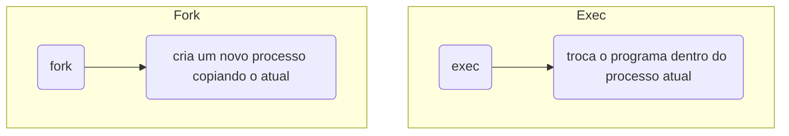

# `fork()`, `wait()`, `exec()` e Ciclo de Vida do Processo

Um processo pode criar outro processo. E mais, um processo pode ser criado como cópia de outro, depois trocar completamente o programa que está executando. Essa é a base de como o `shell` executa comandos, como servidores criam workers, como pipelines funcionam e como processos pais controlam filhos.

Imagina que tenhamos um processo rodando, o `shell` e o `shell` precisa executar outro programa, como por exemplo, o `ls`. Uma possibilidade seria o `shell` simplesmente "virar" o `ls`, mas se o `shell` virasse o `ls`, quando `ls` terminasse, o `shell` teria sumido.

O Unix separou a criação de processo em duas operações diferentes:



O Shell faz mais ou menos isso:

1. Shell chama `fork()`
2. Pai continua sendo Shell
3. Filho chama `exec("ls")`

Depois o Pai espera o filho terminar com `wait()`

## Fork

Conceitualmente, `fork()` cria um processo filho a partir do processo pai. O filho nasce muito parecido com o pai:

- Mesmo código
- Mesmas variáveis no momento do fork
- Mesmos file descriptors abertos
- Mesmo diretório atual
- Mesmas variáveis de ambiente
- Mesma posição de execução

Mas são processos diferentes, pois cada um tem:

- PID próprio
- Memória virtual própria
- Estado próprio
- Execução própria

O `fork()` retorna duas vezes. Para o pai, `fork()` retorna o PID do filho. Para o filho, `fork()` retorna 0. Se der erro, retorna -1.

```c
#include <stdio.h>
#include <unistd.h>
#include <sys/types.h>

int main() {
    pid_t pid = fork();

    if (pid == -1) {
        perror("fork");
        return 1;
    }

    if (pid == 0) {
        printf("Sou o processo filho. Meu PID é %d. Meu pai tem PID %d\n", getpid(), getppid());
    } else {
        printf("Sou o pai. Meu PID é %d\n. Criei o filho com PID %d\n", getpid(), pid);
    }
    
    return 0;
}
```

A ordem de impressão pode mudar, pois depois do `fork()`, pai e filho são processos diferentes e independentes. O scheduler do kernel decide quem roda primeiro.

## Exec

O `exec()` troca o programa que está rodando dentro do processo atual. Ele não cria outro processo, ele substitui a imagem de memória do processo atual, por exemplo:

Antes:

```text
text  -> código do programa ani
data  -> variáveis globais do programa antigo 
heap  -> mallocs do programa antigo
stack -> chamadas do programa antigo
```

Depois do `exec()`:

```text
text  -> código do novo programa
data  -> globais do novo programa
heap  -> novo heap
stack -> nova stack inicial
```

É importante saber que o `exec()` não retorna em caso de sucesso, porque se `exec()` deu certo, o programa antigo foi substituído. A linha depois do `exec()` só executa se houver erro.

```c
#include <stdio.h>
#include <unistd.h>

int main() {
    printf("Antes do exec\n");
    execlp("ls", "ls", "-l", NULL);
    perror("execlp");
    return 1;
}
```

## Wait

Quando um processo filho termina, o pai precisa coletar seu resultado. O `wait()` serve para:

- Esperar um filho terminar
- Coletar seu status de saída
- Remover o processo zumbi da tabela do kernel

```c
int status;
pid_t filho = wait(&status);
```

### Processo Zumbi

Um processo zumbi não está mais executando, ele não consome CPU, a memória principal dele já foi liberada, mas ainda existe uma entrada mínima na tabela de processos, contendo informações de término.

Se o pai nunca chamar `wait()`, o zumbi fica lá.

Corrigindo o código:

```c
#include <stdio.h>
#include <unistd.h>
#include <sys/wait.h>
#include <sys/types.h>

int main() {
    pid_t pid = fork();

    if (pid == -1) {
        perror("fork");
        return 1;
    }

    if (pid == 0) {
        printf("Filho terminando. PID = %d\n", getpid());
        return 0;
    } else {
        int status;
        wait(&status);
        printf("Pai coletou o filho.\n");
    }
    return 0;
}
```

Agora o filho não fica zumbi.

Usando `waitpid()`, conseguimos escolher qual filho esperar.
