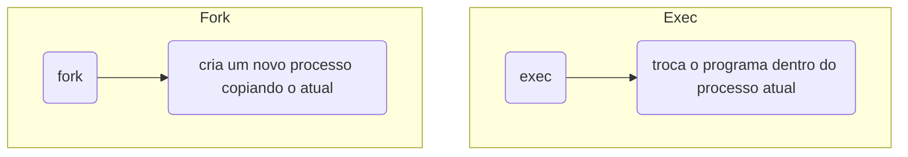

# `fork()`, `wait()`, família `exec` e ciclo de vida do processo

Um processo pode criar outro como uma cópia de si mesmo e, em seguida, substituir o programa executado pelo novo processo. Esse mecanismo é a base de como o *shell* executa comandos, servidores criam processos de trabalho (*workers*), *pipelines* funcionam e processos pais controlam seus filhos.

Imagine que o *shell* precise executar outro programa, como `ls`. Se o próprio processo do *shell* fosse substituído diretamente pelo `ls`, ele deixaria de existir quando o comando terminasse.

O Unix separou a criação de processo em duas operações diferentes:



O *shell* faz, de forma simplificada, o seguinte:

1. O *shell* chama `fork()`.
2. O processo pai continua executando o *shell*.
3. O processo filho chama uma função da família `exec` para executar `ls`.

Depois, o processo pai espera o filho terminar com `wait()` ou `waitpid()`.

## Fork

Conceitualmente, `fork()` cria um processo filho a partir do processo pai. O filho nasce muito parecido com o pai:

- O mesmo código.
- Cópias das variáveis existentes no momento de `fork()`.
- Descritores correspondentes aos mesmos arquivos abertos.
- O mesmo diretório de trabalho atual.
- Cópias das mesmas variáveis de ambiente.
- Continuação da execução logo após `fork()`.

Mas são processos diferentes, pois cada um tem:

- PID próprio.
- Espaço de memória virtual próprio.
- Estado próprio.
- Fluxo de execução próprio.

Quando `fork()` é bem-sucedida, pai e filho continuam a partir da instrução seguinte. No pai, a função retorna o PID do filho; no filho, retorna `0`. Em caso de erro, somente o processo pai continua, e a função retorna `-1`.

```c
#include <stdio.h>
#include <unistd.h>
#include <sys/types.h>

int main(void) {
    pid_t pid = fork();

    if (pid == -1) {
        perror("fork");
        return 1;
    }

    if (pid == 0) {
        printf(
            "Sou o processo filho. Meu PID é %ld e o PID do meu pai é %ld.\n",
            (long)getpid(),
            (long)getppid()
        );
    } else {
        printf(
            "Sou o processo pai. Meu PID é %ld e criei o filho %ld.\n",
            (long)getpid(),
            (long)pid
        );
    }

    return 0;
}
```

A ordem das mensagens pode mudar, pois, depois de `fork()`, pai e filho são processos diferentes. O escalonador do kernel decide qual deles executará primeiro.

## Exec

As funções da família `exec` substituem o programa executado pelo processo atual. Elas não criam outro processo; em caso de sucesso, o PID é preservado e a imagem do programa é substituída. Descritores sem a opção `FD_CLOEXEC` permanecem abertos.

Antes:

```text
text  -> código do programa antigo
data  -> variáveis globais do programa antigo
heap  -> alocações do programa antigo
stack -> pilha do programa antigo
```

Depois do `exec()`:

```text
text  -> código do novo programa
data  -> variáveis globais do novo programa
heap  -> novo heap
stack -> nova pilha inicial
```

É importante saber que uma função da família `exec` não retorna em caso de sucesso, pois o programa anterior foi substituído. A instrução seguinte somente é executada se ocorrer um erro.

```c
#include <stdio.h>
#include <unistd.h>

int main(void) {
    printf("Antes de execlp().\n");
    fflush(stdout);

    execlp("ls", "ls", "-l", NULL);
    perror("execlp");
    return 1;
}
```

## Wait

Quando um processo filho termina, o pai precisa coletar seu resultado. O `wait()` serve para:

- Esperar um filho terminar.
- Coletar seu status de saída.
- Remover a entrada do processo zumbi da tabela mantida pelo kernel.

```c
int status;
pid_t filho = wait(&status);
```

### Processo zumbi

Um processo zumbi não está mais em execução e não consome tempo de CPU. Seus principais recursos já foram liberados, mas uma entrada mínima, com informações sobre o término, permanece na tabela de processos.

Essa entrada permanece até que o pai colete o estado do filho ou termine; nesse último caso, outro processo do sistema adota e coleta o filho.

Corrigindo o código:

```c
#include <stdio.h>
#include <unistd.h>
#include <sys/wait.h>
#include <sys/types.h>

int main(void) {
    pid_t pid = fork();

    if (pid == -1) {
        perror("fork");
        return 1;
    }

    if (pid == 0) {
        printf("Filho %ld terminando.\n", (long)getpid());
        return 0;
    } else {
        int status;

        if (waitpid(pid, &status, 0) == -1) {
            perror("waitpid");
            return 1;
        }

        printf("Pai coletou o filho.\n");
    }
    return 0;
}
```

Agora a entrada do filho é coletada, e ele não permanece como zumbi.

Usando `waitpid()`, conseguimos escolher qual filho esperar.
