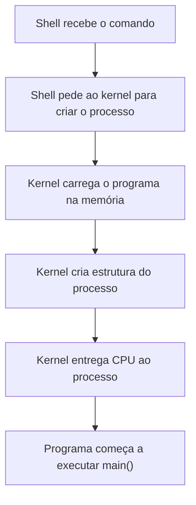
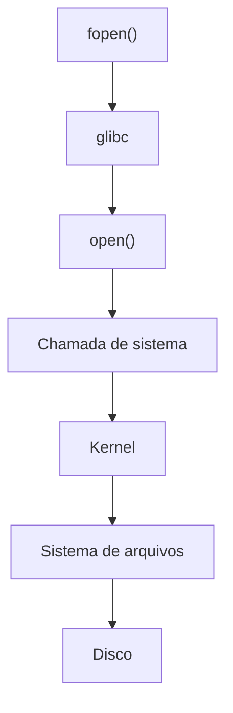

# Programa, processo e kernel

## Programa

Um programa executável é um conjunto de instruções e dados armazenado em um arquivo. Enquanto não é executado, ele não constitui um processo.

O arquivo `hello_world.c`, por exemplo, contém código-fonte. Depois da compilação, o arquivo executável resultante pode ser carregado para criar um processo.

## Processo

Um processo é uma instância de um programa em execução. Quando executamos `./hello_world`, o sistema operacional carrega o programa na memória e cria as estruturas necessárias para o novo processo.


Para mostrar processos ativos, basta utilizar o comando:

```bash
ps
# Ou com mais detalhes:
ps aux
```

Um processo possui, entre outros elementos:

- Código do programa.
- Variáveis globais.
- *Heap*.
- Pilha (*stack*).
- Registradores da CPU.
- Descritores de arquivo.
- PID.
- Estado do processo.
- Credenciais e permissões.

### Estados do processo

Em um modelo simplificado, um processo pode estar nos seguintes estados:

- **READY**: pronto para receber tempo de CPU.
- **RUNNING**: em execução na CPU.
- **BLOCKED**: bloqueado enquanto aguarda um evento.
- **TERMINATED**: finalizado.

Exemplo:

Se não houver dados para ler:


Quando os dados chegam:


### PID

PID significa *Process ID*. É o identificador único de um processo enquanto ele está ativo.

Exemplo em C:

```c
#include <stdio.h>
#include <unistd.h>

int main(void) {
    printf("Meu PID: %ld.\n", (long)getpid());
    printf("PID do processo pai: %ld.\n", (long)getppid());

    for (;;) {
        sleep(1);
    }
}
```

Podemos compilar o programa e verificar seu PID:

```bash
gcc my_pid.c -o my_pid

./my_pid

ps aux | grep my_pid
```

### Exemplo mental



## Kernel

O **kernel** é o núcleo do sistema operacional. Ele gerencia processos, memória, dispositivos e outros recursos do computador, incluindo:

- CPU.
- Memória.
- Discos.
- Rede.
- Dispositivos USB.
- Mouse e teclado.

### Rings

A arquitetura x86 define níveis de privilégio chamados **anéis** (*rings*). Sistemas operacionais de uso geral normalmente utilizam principalmente:

- **Ring 0**.
- **Ring 3**.

#### Ring 0

É o nível em que o kernel executa. Nesse nível, o código pode acessar a memória e os dispositivos, controlar a CPU e gerenciar processos. Em resumo, possui **privilégio máximo**.

#### Ring 3

É nesse nível que executam os programas do usuário, como Chrome, VS Code, Firefox e nossas aplicações em C. Esses programas possuem restrições e não podem acessar diretamente recursos protegidos.

O ambiente dos programas executados nesse nível é chamado de **espaço do usuário** (*user space*).

### Chamada de sistema

Programas no espaço do usuário solicitam serviços ao kernel por meio de **chamadas de sistema** (*system calls*). A função `printf()`, por exemplo, escreve em um *buffer* da biblioteca padrão; quando esse *buffer* precisa ser enviado ao descritor de saída, a biblioteca pode usar a chamada `write()`.

Exemplo ao abrir um arquivo em C:



Essa mudança do modo de usuário para o modo kernel é chamada de **mudança de modo** (*mode switch*) ou **transição para o kernel**. Ela não implica necessariamente a troca do processo em execução.

#### Por que chamadas de sistema custam mais?

Uma função comum, como `int soma(int a, int b) { return a + b; }`, executa inteiramente no espaço do usuário. Já uma chamada de sistema precisa realizar etapas adicionais, como:

1. Mudar para o modo kernel.
2. Preservar o estado necessário da CPU.
3. Validar argumentos.
4. Verificar permissões.
5. Executar a operação solicitada.
6. Voltar ao espaço do usuário.

Essas etapas custam mais ciclos de CPU que uma chamada de função comum. Recursos como o *buffer* da `glibc` podem reduzir chamadas de sistema desnecessárias.

### glibc

Normalmente acessamos as chamadas de sistema por meio de funções fornecidas pela biblioteca C. Em sistemas GNU/Linux, funções como `printf()`, `malloc()` e `fopen()` geralmente são fornecidas pela glibc, que atua como uma camada entre o programa e o kernel.

Podemos observar as chamadas de sistema realizadas por um programa com `strace`:

```bash
strace programa

# Exemplo:

strace ls
```

## Principais conceitos

- **Programa**: conjunto de instruções e dados armazenado em um arquivo.
- **Processo**: instância de um programa em execução.
- **PID**: identificador de um processo.
- **Kernel**: núcleo do sistema operacional.
- **Chamada de sistema**: solicitação feita por um processo ao kernel.
