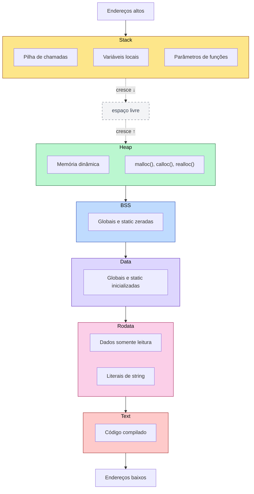
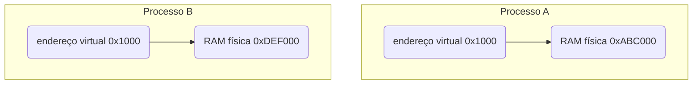

# Memória de processo: *text*, *data*, BSS, *heap* e pilha

Um processo possui um **espaço de endereçamento virtual**, controlado pelo kernel e organizado em mapeamentos com finalidades e permissões diferentes.

## Programa no disco e processo na memória

- **Programa**: conjunto de instruções e dados armazenado em um arquivo executável.
- **Processo**: instância de um programa em execução.

Quando executamos `gcc main.c -o app`, criamos um arquivo executável. Ao executar `./app`, o *shell* normalmente cria um processo filho e usa a chamada de sistema `execve()` para substituir o programa desse processo por `app`.

O diagrama abaixo apresenta um modelo clássico e simplificado do espaço de endereçamento. A disposição real varia conforme o sistema, a arquitetura, o carregador, o executável e mecanismos como ASLR:



## Memória virtual

Um processo não acessa diretamente a RAM física. Ele acessa endereços virtuais. Exemplo:

```c
int x = 10;

printf("%p\n", (void *)&x);
```

```text
0x7ffd1a2b3c4c
```

Esse valor é um **endereço virtual**, não um endereço físico da RAM. Cada processo possui seu próprio espaço de endereçamento. Assim, processos diferentes podem usar o mesmo endereço virtual, mas associá-lo a páginas físicas diferentes ou até a páginas que ainda não estão presentes na RAM.

Exemplo conceitual:



A **unidade de gerenciamento de memória** (MMU, de *memory management unit*) realiza a tradução com base em tabelas de páginas configuradas pelo kernel. A CPU também utiliza estruturas de cache, como a TLB, para acelerar essas traduções.

A memória virtual existe por vários motivos explicados abaixo.

### Isolamento

Em condições normais, um processo não pode acessar livremente a memória de outro. Esse isolamento reduz o impacto de programas defeituosos ou maliciosos.

### Segurança

Se um processo tentar acessar uma área proibida, por exemplo:

```c
int *p = NULL;
*p = 10;
```

Desreferenciar um ponteiro nulo produz comportamento indefinido em C. Em sistemas semelhantes ao Unix, esse acesso normalmente é detectado pelo hardware, e o kernel envia `SIGSEGV` ao processo, resultando na mensagem **Segmentation fault**.

### Organização

O kernel consegue marcar regiões com permissões diferentes. Exemplo:

```text
Text   -> leitura + execução
Data   -> leitura + escrita
Stack  -> leitura + escrita
Heap   -> leitura + escrita
Rodata -> somente leitura
```

Assim, uma tentativa de escrever em um mapeamento sem permissão de escrita normalmente provoca uma falha de proteção.

### Eficiência

Vários processos podem compartilhar páginas físicas que contêm o código de uma biblioteca. Por exemplo, as mesmas páginas da `libc` podem ser mapeadas nos espaços virtuais dos processos que a utilizam.

## Arquivo executável: ELF

No Linux, os executáveis geralmente usam o formato **ELF** (*Executable and Linkable Format*). Seções organizam informações para ligação e depuração, enquanto segmentos descrevem o que o carregador deve mapear na memória. Algumas seções comuns são:

- `.text`: código compilado.
- `.rodata`: dados somente para leitura.
- `.data`: dados estáticos inicializados e modificáveis.
- `.bss`: dados estáticos zerados.
- `.symtab`: tabela de símbolos, quando presente.
- `.debug_*`: informações de depuração, normalmente geradas com `-g`.

Podemos inspecionar um programa com:

```bash
readelf -S ./app

# Ou com:

objdump -h ./app

# Ou se quisermos ver o tamanho das regiões principais:

size ./app
```

## Região *text*

A região ***text*** contém o código compilado do programa.

```c
int soma(int a, int b) {
    return a + b;
}
```

Depois de compilado, isso vira instrução de máquina. Algo conceitualmente parecido com:

```assembly
mov eax, edi
add eax, esi
ret
```

Essas instruções normalmente ficam em um segmento executável que inclui `.text`. Em geral, o mapeamento possui permissões `r-x`: leitura e execução, sem escrita. Essa separação dificulta a modificação acidental ou maliciosa do código.

## Região *rodata*

A seção `.rodata` normalmente guarda dados somente para leitura. Em `const char *msg = "Olá, mundo!\n";`, por exemplo, o literal costuma ficar em um mapeamento sem permissão de escrita. A variável `msg` pode ter armazenamento automático ou estático, dependendo do local em que foi declarada.

Exemplo perigoso:

```c
#include <stdio.h>

int main(void) {
    char *name = "Lucas";
    name[0] = 'M';
    printf("%s\n", name);
    return 0;
}
```

Modificar um literal de *string* produz comportamento indefinido e frequentemente causa `Segmentation fault`. Para criar uma cópia local modificável, usamos `char name[] = "Lucas";`.

## Região Data

A seção `.data` normalmente guarda variáveis modificáveis com duração estática e valor inicial diferente de zero. Exemplo:

```c
int total = 10;
static int contador = 5;
```

O arquivo precisa armazenar os valores iniciais dessas variáveis, que existem durante toda a execução do programa.

## Região BSS

A seção `.bss` normalmente representa variáveis modificáveis com duração estática que começam com zero. Exemplo:

```c
int contador;
static int total;
int valor = 0;
```

Essas variáveis começam com zero. Variáveis com duração estática que não possuem inicializador explícito são automaticamente zeradas pela linguagem.

```c
#include <stdio.h>

int variavel;

int main(void) {
    printf("%d\n", variavel);
    return 0;
}
```

O `.bss` ocupa espaço na memória do processo, mas não necessariamente ocupa o mesmo espaço no arquivo executável. Teste:

```c
char grande[100000000];

int main(void) {
    return 0;
}
```

Compilando e testando:

```bash
gcc bss.c -o bss
ls -lh bss
size bss
```

Resultado:

```text
ls -lh bss:
-rwxrwxr-x 1 lcsgborges lcsgborges 16K Jun 27 16:44 bss

size bss:
   text	   data	    bss	    dec	        hex	      filename
   1228	   544	 100000032	100001804	5f5e80c	  bss
```

Nesse exemplo, o executável não ocupa 100 MB no disco: possui apenas cerca de 16 KB. Entretanto, `size` mostra que a seção BSS representa aproximadamente 100 MB na imagem carregada.

## Stack

A **stack** é a pilha de execução do processo. Guarda principalmente:

- Chamadas de função.
- Algumas variáveis locais.
- Alguns parâmetros.
- Endereços de retorno.
- Registradores salvos.

### Stack frame

Uma chamada de função pode criar um **quadro de pilha** (*stack frame*), embora otimizações possam eliminar ou modificar essa estrutura. Exemplo:

```c
int soma(int a, int b) {
    int res = a + b;
    return res;
}
```

O stack frame pode conter:

- Parâmetro `a`.
- Parâmetro `b`.
- Variável `res`.
- Endereço de retorno.
- Registradores salvos.
- Espaço de alinhamento.

O endereço de retorno é fundamental, pois quando uma função termina, a CPU precisa saber para onde voltar.

Em uma disposição comum, a pilha cresce em direção a endereços menores, enquanto a área tradicional administrada por `brk()` cresce em direção a endereços maiores. Isso é uma convenção da plataforma, não uma exigência da linguagem C. Alocações também podem usar mapeamentos independentes.

### Stack overflow

A pilha possui um limite. Uma recursão sem condição de parada pode esgotá-la e produzir comportamento indefinido, normalmente manifestado como uma falha de segmentação.

## Heap

O ***heap*** é usado pelo alocador para fornecer memória dinâmica. Ele é útil quando o tamanho ou o tempo de vida de uma alocação depende da execução. Exemplo:

```c
#include <stdio.h>
#include <stdlib.h>

int main(void) {
    int n;

    if (scanf("%d", &n) != 1 || n <= 0) {
        fprintf(stderr, "Tamanho inválido.\n");
        return 1;
    }

    int *vet = calloc((size_t)n, sizeof(*vet));

    if (vet == NULL) {
        perror("calloc");
        return 1;
    }

    // Usa o vetor.

    free(vet);
    return 0;
}
```

No exemplo acima, o tamanho do vetor só é conhecido durante a execução.

## Exemplo prático

```c
#include <stdio.h>
#include <stdlib.h>
#include <unistd.h>

int global_inicializada = 10;
int global_nao_inicializada;

static int static_inicializada = 20;
static int static_nao_inicializada;

const char *string_literal = "Estou em rodata";

int main(void) {
    int local = 30;
    static int static_local = 40;

    int *heap = malloc(sizeof(int));
    if (heap == NULL) {
        perror("malloc");
        return 1;
    }

    *heap = 50;

    printf("PID do processo: %ld.\n\n", (long)getpid());

    printf("Endereço de string literal      (.rodata): %p\n", (void *) string_literal);

    printf("Endereço global_inicializada    (.data):   %p\n", (void *) &global_inicializada);
    printf("Endereço static_inicializada    (.data):   %p\n", (void *) &static_inicializada);
    printf("Endereço static_local           (.data):   %p\n", (void *) &static_local);

    printf("Endereço global_nao_inicializada(.bss):    %p\n", (void *) &global_nao_inicializada);
    printf("Endereço static_nao_inicializada(.bss):    %p\n", (void *) &static_nao_inicializada);

    printf("Endereço heap                   (heap):    %p\n", (void *) heap);
    printf("Endereço local                  (stack):   %p\n", (void *) &local);

    printf("\nPressione Enter para finalizar.\n");
    getchar();

    free(heap);

    return 0;
}
```

Compilando com `gcc -Wall -Wextra -O0 -g memoria.c -o memoria`. Executando, temos:

```text
04:56:14 lcsgborges@ubuntu processos ±|main ✗|→ ./memoria
PID do processo: 132148

Endereço de string literal      (.rodata): 0x567071603008
Endereço global_inicializada    (.data):   0x567071605010
Endereço static_inicializada    (.data):   0x567071605014
Endereço static_local           (.data):   0x567071605018
Endereço global_nao_inicializada(.bss):    0x56707160502c
Endereço static_nao_inicializada(.bss):    0x567071605030
Endereço heap                   (heap):    0x567084f542a0
Endereço local                  (stack):   0x7ffd199076dc

Pressione Enter para finalizar.
```

Usando o PID impresso pelo programa e executando `cat /proc/132148/maps`, temos:

```text
04:57:57 lcsgborges@ubuntu dev-notes ±|main ✗|→ cat /proc/132148/maps
567071601000-567071602000 r--p 00000000 103:06 16532464                  /home/lcsgborges/personal/dev-notes/docs/c/processos/memoria
567071602000-567071603000 r-xp 00001000 103:06 16532464                  /home/lcsgborges/personal/dev-notes/docs/c/processos/memoria
567071603000-567071604000 r--p 00002000 103:06 16532464                  /home/lcsgborges/personal/dev-notes/docs/c/processos/memoria
567071604000-567071605000 r--p 00002000 103:06 16532464                  /home/lcsgborges/personal/dev-notes/docs/c/processos/memoria
567071605000-567071606000 rw-p 00003000 103:06 16532464                  /home/lcsgborges/personal/dev-notes/docs/c/processos/memoria
567084f54000-567084f75000 rw-p 00000000 00:00 0                          [heap]
735c1e400000-735c1e428000 r--p 00000000 103:06 12623381                  /usr/lib/x86_64-linux-gnu/libc.so.6
735c1e428000-735c1e5b0000 r-xp 00028000 103:06 12623381                  /usr/lib/x86_64-linux-gnu/libc.so.6
735c1e5b0000-735c1e5ff000 r--p 001b0000 103:06 12623381                  /usr/lib/x86_64-linux-gnu/libc.so.6
735c1e5ff000-735c1e603000 r--p 001fe000 103:06 12623381                  /usr/lib/x86_64-linux-gnu/libc.so.6
735c1e603000-735c1e605000 rw-p 00202000 103:06 12623381                  /usr/lib/x86_64-linux-gnu/libc.so.6
735c1e605000-735c1e612000 rw-p 00000000 00:00 0
735c1e6d7000-735c1e6da000 rw-p 00000000 00:00 0
735c1e6f7000-735c1e6f9000 rw-p 00000000 00:00 0
735c1e6f9000-735c1e6fd000 r--p 00000000 00:00 0                          [vvar]
735c1e6fd000-735c1e6ff000 r--p 00000000 00:00 0                          [vvar_vclock]
735c1e6ff000-735c1e701000 r-xp 00000000 00:00 0                          [vdso]
735c1e701000-735c1e702000 r--p 00000000 103:06 12623378                  /usr/lib/x86_64-linux-gnu/ld-linux-x86-64.so.2
735c1e702000-735c1e72d000 r-xp 00001000 103:06 12623378                  /usr/lib/x86_64-linux-gnu/ld-linux-x86-64.so.2
735c1e72d000-735c1e737000 r--p 0002c000 103:06 12623378                  /usr/lib/x86_64-linux-gnu/ld-linux-x86-64.so.2
735c1e737000-735c1e739000 r--p 00036000 103:06 12623378                  /usr/lib/x86_64-linux-gnu/ld-linux-x86-64.so.2
735c1e739000-735c1e73b000 rw-p 00038000 103:06 12623378                  /usr/lib/x86_64-linux-gnu/ld-linux-x86-64.so.2
7ffd198e7000-7ffd19909000 rw-p 00000000 00:00 0                          [stack]
ffffffffff600000-ffffffffff601000 --xp 00000000 00:00 0                  [vsyscall]
```

## Tempo de vida das regiões

O armazenamento e o tempo de vida normalmente seguem estas regras. O compilador pode manter valores em registradores, e o alocador pode obter memória por mecanismos diferentes dos nomes apresentados no diagrama:

1. **Global**:
    - Armazenamento típico: `.data` ou `.bss`.
    - Tempo de vida: toda a execução do programa.
2. **Local**:
    - Armazenamento típico: pilha ou registrador.
    - Tempo de vida: enquanto seu bloco está ativo.
3. **Estática**:
    - Armazenamento típico: `.data`, `.bss` ou uma região somente para leitura.
    - Tempo de vida: toda a execução do programa.
4. **Dinâmica**:
    - Armazenamento típico: área administrada pelo alocador.
    - Tempo de vida: da alocação até `free()`.
