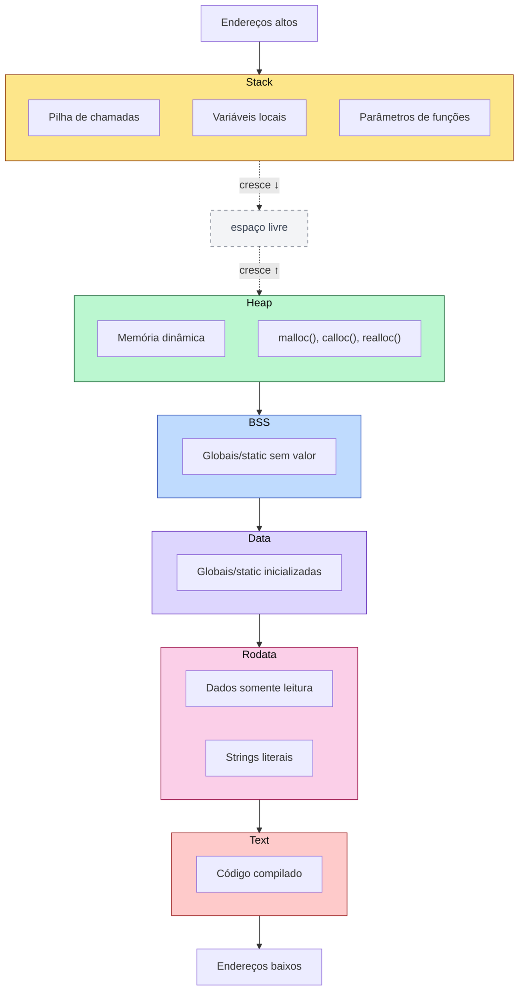
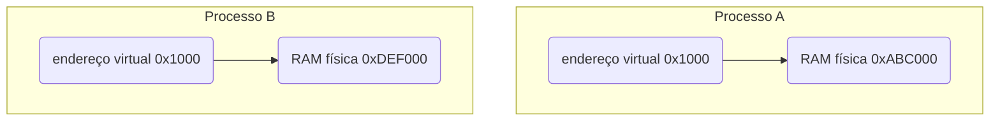

# Memória de Processo: Text, Data, BSS, Heap e Stack

Um processo é um **espaço de memória organizado**, controlado pelo kernel, com regiões diferentes para finalidades diferentes.

## Programa no disco x Processo na memória

- Programa: arquivo executável parado no disco
- Processo: programa carregado e executando na memória

Quando compilamos um arquivo `gcc main.c -o app`, apenas criamos um executável no disco. Quando rodamos `./app`, o shell pede ao kernel para executar esse arquivo. No Linux, isso acontece através da system call: `execve()`. O kernel carrega o executável na memória e cria um processo.

Quando o kernel cria um processo, ele organiza a memória em regiões. O modelo clássico é:



## Memória Virtual

Um processo não acessa diretamente a RAM física. Ele acessa endereços virtuais. Exemplo:

```c
int x = 10;

printf("%p\n", &x);
```

```text
0x7ffd1a2b3c4c
```

Esse endereço não é necessariamente um endereço físico real da RAM. É um **endereço virtual**. O processo acha que tem um espaço de memória próprio, isolado dos outros processos. Cada processo pode ter o mesmo endereço virtual, mas apontando para lugares físicos diferentes.

Exemplo conceitual:



Quem faz essa tradução: `CPU + MMU + tabelas de páginas mantidas pelo kernel`. A MMU é a **Memory Management Unit**, uma parte do hardware responsável por traduzir endereços virtuais para endereços físicos.

A memória virtual existe por vários motivos explicados abaixo.

### Isolamento

Um processo não pode sair lendo a memória de outro processo. O `Processo A` não pode acessar livremente o `Processo B`. Isso evita que um programa bugado ou malicioso destrua outro.

### Segurança

Se um processo tentar acessar uma área proibida, por exemplo:

```c
int *p = NULL;
*p = 10;
```

A CPU detecta o acesso inválido, o kernel é avisado, e o processo recebe `SIGSEGV`, daí vem o famoso **Segmentation fault**.

### Organização

O kernel consegue marcar regiões com permissões diferentes. Exemplo:

```text
Text   -> leitura + execução
Data   -> leitura + escrita
Stack  -> leitura + escrita
Heap   -> leitura + escrita
Rodata -> somente leitura
```

Assim, se tentarmos escrever na região de código ou em uma string literal, pode dar erro.

### Eficiência

Vários processos podem compartilhar a mesma região de código de uma biblioteca. Exemplo: o código da `libc` pode ser carregado uma vez na memória física e mapeado nos processos que usam ela.

## Arquivo executável: ELF

No Linux, os executáveis geralmente usam o formato **ELF** (Executable and Linkable Format). Um executável ELF possui várias partes, chamadas de seções e segmentos. Algumas seções importantes:

- .text: código compilado
- .rodata: dados somente leitura
- .data: variáveis globais inicializadas
- .bss: variáveis globais não inicializadas
- .symtab: tabela de símbolos, se existir
- .debug: informações de debug, se compilado com -g

Podemos inspecionar um programa com:

```bash
readelf -S ./app

# Ou com:

objdump -h ./app

# Ou se quisermos ver o tamanho das regiões principais:

size ./app
```

## Região Text

A região **Text** contém o código compilado do programa.

```c
int soma(int a, int b) {
    return a + b;
}
```

Depois de compilado, isso vira instrução de máquina. Algo conceitualmente parecido com:

```assembly
mov eax, edi
add eax, esi
ret
```

Essas instruções ficam na região `.text`. Normalmente as permissões da região text são: `r-x`, ou seja: *readable, executable, not writable*. Isso porque se um programa pudesse modificar seu próprio código facilmente, isso abriria espaço para vários problemas.

## Região Rodata

A região `.rodata` guarda dados somente de leitura. Exemplo: `char *msg = "Olá, Mundo!\n";`. A string literal `"Olá, Mundo!\n"` normalmente fica em `.rodata`. O ponteiro `msg` pode estar na `stack` ou em `data`, dependendo de onde foi declarado, mas o conteúdo literal fica numa região somente leitura.

Exemplo perigoso:

```c
#include <stdio.h>

int main() {
    char *name = "Lucas";
    name[0] = "M";
    printf("%s\n", name);
    return 0;
}
```

Isso pode causar `Segmentation fault`, pois tentamos modificar uma string literal. O correto seria: `char name[] = "Lucas";`, pois aqui `name` é um array local na stack, contendo apenas uma cópia modificável da string.

## Região Data

A região `.data` guarda variáveis globais ou `static` que possuem valor inicialmente diferente de zero. Exemplo:

```c
int total = 10;
static int contador = 5;
```

Essas variáveis já têm valor conhecido no momento da compilação. Então o executável precisa carregar esse valor e elas existem enquanto o programa estiver rodando.

## Região BSS

A região `.bss` guarda variáveis globais ou `static` que não foram inicializadas explicitamente, ou foram inicializadas com zero. Exemplo:

```c
int contador;
static int total;
int valor = 0;
```

Essas variáveis começam com zero. Váriaveis globais não inicializadas são automaticamente zeradas.

```c
#include <stdio.h>

int variavel;

int main() {
    printf("%d\n", variavel);
    return 0;
}
```

O `.bss` ocupa espaço na memória do processo, mas não necessariamente ocupa o mesmo espaço no arquivo executável. Teste:

```c
char grande[100000000];

int main() {
    return 0;
}
```

Compilando e testando:

```bash
gcc bss.c -o bss
ls -lh bss
size bss
```

Resultado:

```text
ls -lh bss:
-rwxrwxr-x 1 lcsgborges lcsgborges 16K Jun 27 16:44 bss

size bss:
   text	   data	    bss	    dec	        hex	      filename
   1228	   544	 100000032	100001804	5f5e80c	  bss
```

O executável não tem `100MB`, tem apenas `16KB`, mas o `size` mostra um BSS grande.

## Stack

A **stack** é a pilha de execução do processo. Guarda principalmente:

- chamadas de funções
- variáveis locais
- parâmetros
- endereços de retorno
- registradores salvos

### Stack frame

Cada chamada de função cria um **stack frame**. Exemplo:

```c
int soma(int a, int b) {
    int res = a + b;
    return res;
}
```

O stack frame pode conter:

- parâmetro `a`
- parâmetro `b`
- variável `res`
- endereço de retorno
- registradores salvos
- alinhamento

O endereço de retorno é fundamental, pois quando uma função termina, a CPU precisa saber para onde voltar.

A **stack** cresce para baixo, enquanto a **heap** cresce para cima. Se crescerem demais, podem colidir ou atingir áreas inválidas.

### Stack overflow

A stack tem tamanho limitado. Se fizermos recursão infinita, a stack cresce até atingir uma região proibida. E geralmente a stack é bem pequena comparada com a heap.

## Heap

O **heap** é usado para memória dinâmica. Ele serve para situações em que não sabemos, em tempo de compilação, quanto espaço vamos precisar. Exemplo:

```c
int n;
scanf("%d", &n);

int *vet = malloc(n * sizeof(int));
```

No exemplo acima, o tamanho do vetor só é conhecido durante a execução.

## Exemplo prático

```c
#include <stdio.h>
#include <stdlib.h>
#include <unistd.h>

int global_inicializada = 10;
int global_nao_inicializada;

static int static_inicializada = 20;
static int static_nao_inicializada;

const char *string_literal = "Estou em rodata";

void minha_funcao() {
    printf("Endereço de minha_funcao        (.text):   %p\n", (void *) minha_funcao);
}

int main() {
    int local = 30;
    static int static_local = 40;

    int *heap = malloc(sizeof(int));
    if (heap == NULL) {
        perror("malloc");
        return 1;
    }

    *heap = 50;

    printf("PID do processo: %d\n\n", getpid());

    printf("Endereço de minha_funcao        (.text):   %p\n", (void *) minha_funcao);
    printf("Endereço de string literal      (.rodata): %p\n", (void *) string_literal);

    printf("Endereço global_inicializada    (.data):   %p\n", (void *) &global_inicializada);
    printf("Endereço static_inicializada    (.data):   %p\n", (void *) &static_inicializada);
    printf("Endereço static_local           (.data):   %p\n", (void *) &static_local);

    printf("Endereço global_nao_inicializada(.bss):    %p\n", (void *) &global_nao_inicializada);
    printf("Endereço static_nao_inicializada(.bss):    %p\n", (void *) &static_nao_inicializada);

    printf("Endereço heap                   (heap):    %p\n", (void *) heap);
    printf("Endereço local                  (stack):   %p\n", (void *) &local);

    printf("\nPressione ENTER para finalizar...\n");
    getchar();

    free(heap);

    return 0;
}
```

Compilando com `gcc -Wall -Wextra -O0 -g memoria.c -o memoria`. Executando, temos:

```text
04:56:14 lcsgborges@ubuntu processos ±|main ✗|→ ./memoria
PID do processo: 132148

Endereço de minha_funcao        (.text):   0x567071602229
Endereço de string literal      (.rodata): 0x567071603008
Endereço global_inicializada    (.data):   0x567071605010
Endereço static_inicializada    (.data):   0x567071605014
Endereço static_local           (.data):   0x567071605018
Endereço global_nao_inicializada(.bss):    0x56707160502c
Endereço static_nao_inicializada(.bss):    0x567071605030
Endereço heap                   (heap):    0x567084f542a0
Endereço local                  (stack):   0x7ffd199076dc

Pressione ENTER para finalizar...
```

Usando o PID impresso pelo programa e executando `cat /proc/132148/maps`, temos:

```text
04:57:57 lcsgborges@ubuntu dev-notes ±|main ✗|→ cat /proc/132148/maps
567071601000-567071602000 r--p 00000000 103:06 16532464                  /home/lcsgborges/personal/dev-notes/docs/c/processos/memoria
567071602000-567071603000 r-xp 00001000 103:06 16532464                  /home/lcsgborges/personal/dev-notes/docs/c/processos/memoria
567071603000-567071604000 r--p 00002000 103:06 16532464                  /home/lcsgborges/personal/dev-notes/docs/c/processos/memoria
567071604000-567071605000 r--p 00002000 103:06 16532464                  /home/lcsgborges/personal/dev-notes/docs/c/processos/memoria
567071605000-567071606000 rw-p 00003000 103:06 16532464                  /home/lcsgborges/personal/dev-notes/docs/c/processos/memoria
567084f54000-567084f75000 rw-p 00000000 00:00 0                          [heap]
735c1e400000-735c1e428000 r--p 00000000 103:06 12623381                  /usr/lib/x86_64-linux-gnu/libc.so.6
735c1e428000-735c1e5b0000 r-xp 00028000 103:06 12623381                  /usr/lib/x86_64-linux-gnu/libc.so.6
735c1e5b0000-735c1e5ff000 r--p 001b0000 103:06 12623381                  /usr/lib/x86_64-linux-gnu/libc.so.6
735c1e5ff000-735c1e603000 r--p 001fe000 103:06 12623381                  /usr/lib/x86_64-linux-gnu/libc.so.6
735c1e603000-735c1e605000 rw-p 00202000 103:06 12623381                  /usr/lib/x86_64-linux-gnu/libc.so.6
735c1e605000-735c1e612000 rw-p 00000000 00:00 0
735c1e6d7000-735c1e6da000 rw-p 00000000 00:00 0
735c1e6f7000-735c1e6f9000 rw-p 00000000 00:00 0
735c1e6f9000-735c1e6fd000 r--p 00000000 00:00 0                          [vvar]
735c1e6fd000-735c1e6ff000 r--p 00000000 00:00 0                          [vvar_vclock]
735c1e6ff000-735c1e701000 r-xp 00000000 00:00 0                          [vdso]
735c1e701000-735c1e702000 r--p 00000000 103:06 12623378                  /usr/lib/x86_64-linux-gnu/ld-linux-x86-64.so.2
735c1e702000-735c1e72d000 r-xp 00001000 103:06 12623378                  /usr/lib/x86_64-linux-gnu/ld-linux-x86-64.so.2
735c1e72d000-735c1e737000 r--p 0002c000 103:06 12623378                  /usr/lib/x86_64-linux-gnu/ld-linux-x86-64.so.2
735c1e737000-735c1e739000 r--p 00036000 103:06 12623378                  /usr/lib/x86_64-linux-gnu/ld-linux-x86-64.so.2
735c1e739000-735c1e73b000 rw-p 00038000 103:06 12623378                  /usr/lib/x86_64-linux-gnu/ld-linux-x86-64.so.2
7ffd198e7000-7ffd19909000 rw-p 00000000 00:00 0                          [stack]
ffffffffff600000-ffffffffff601000 --xp 00000000 00:00 0                  [vsyscall]
```

## Tempo de vida das regiões

Cada tipo de variável tem um tempo de vida diferente:

1. Global
    - Região: data
    - Tempo de vida: processo inteiro
2. Local
    - Região: stack
    - Tempo de vida: enquanto a função está executando
3. Estática
    - Região: data ou bss
    - Tempo de vida: processo inteiro
4. Dinâmica
    - Região: heap
    - Tempo de vida: até chamar free()
