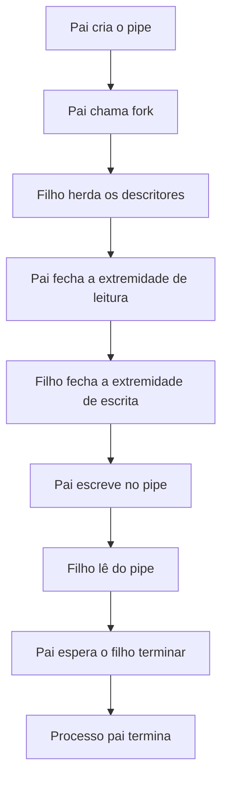

# Pipes

Um **pipe** é um canal de comunicação que o kernel usa para transportar bytes entre processos.

> IPC significa *interprocess communication*, ou comunicação entre processos. Um *pipe* é um mecanismo de IPC.

Um pipe é utilizado para enviar dados entre processos. No shell é muito simples ver isso:

```bash
ls | grep '\.c$'
```

Esse `|` é um pipe. O `ls` escreve no pipe e o `grep` lê do pipe.

## *Pipe* anônimo

O pipe mais básico é o **anonymous pipe**. Ele não tem nome no sistema de arquivos e normalmente é usado entre processos relacionados, principalmente entre pai e filho após um `fork()`.

```c
int fd[2];
pipe(fd);
```

Depois disso, passamos a ter:

```text
fd[0] -> serve para realizar leitura
fd[1] -> serve para realizar escrita
```

Um detalhe importante é que o ***pipe* é unidirecional**. Para estabelecer comunicação nos dois sentidos, usamos dois *pipes*.

## Exemplo 1: mesmo processo escrevendo e lendo

```c
#include <stdio.h>
#include <unistd.h>
#include <string.h>

int main(void) {
    int fd[2];

    if (pipe(fd) == -1) {
        perror("pipe");
        return 1;
    }

    const char *msg = "Olá pelo pipe";

    if (write(fd[1], msg, strlen(msg)) == -1) {
        perror("write");
        close(fd[0]);
        close(fd[1]);
        return 1;
    }

    char buffer[100];

    ssize_t n = read(fd[0], buffer, sizeof(buffer) - 1);

    if (n == -1) {
        perror("read");
        close(fd[0]);
        close(fd[1]);
        return 1;
    }

    buffer[n] = '\0';
    printf("Recebido: %s.\n", buffer);

    close(fd[0]);
    close(fd[1]);

    return 0;
}
```

## Exemplo 2: pai envia uma mensagem ao filho

```c
#include <stdio.h>
#include <unistd.h>
#include <string.h>
#include <sys/wait.h>
#include <sys/types.h>

int main(void) {
    int fd[2];

    if (pipe(fd) == -1) {
        perror("pipe");
        return 1;
    }

    pid_t pid = fork();

    if (pid == -1) {
        perror("fork");
        close(fd[0]);
        close(fd[1]);
        return 1;
    }

    if (pid == 0) {
        // O filho somente lê.
        close(fd[1]);

        char buffer[100];

        ssize_t n = read(fd[0], buffer, sizeof(buffer) - 1);

        if (n == -1) {
            perror("read");
            close(fd[0]);
            return 1;
        }

        buffer[n] = '\0';

        printf("Filho recebeu: %s", buffer);

        close(fd[0]);

        return 0;
    } else {
        // O pai somente escreve.
        close(fd[0]);

        const char *msg = "Mensagem enviada pelo pai.\n";

        if (write(fd[1], msg, strlen(msg)) == -1) {
            perror("write");
            close(fd[1]);
            return 1;
        }

        close(fd[1]);

        if (waitpid(pid, NULL, 0) == -1) {
            perror("waitpid");
            return 1;
        }
    }
    return 0;
}
```

O fluxo é o seguinte:



## Exemplo 3: ler até o EOF

Esse é um exemplo mais realista: o pai escreve várias mensagens e fecha o pipe. O filho lê até acabar.

```c
#include <stdio.h>
#include <unistd.h>
#include <string.h>
#include <sys/wait.h>
#include <sys/types.h>

int main(void) {
    int fd[2];

    if (pipe(fd) == -1) {
        perror("pipe");
        return 1;
    }

    pid_t pid = fork();

    if (pid == -1) {
        perror("fork");
        close(fd[0]);
        close(fd[1]);
        return 1;
    }

    if (pid == 0) {
        close(fd[1]);

        char buffer[64];
        ssize_t n;

        while ((n = read(fd[0], buffer, sizeof(buffer))) > 0) {
            size_t total = 0;

            while (total < (size_t)n) {
                ssize_t written = write(
                    STDOUT_FILENO,
                    buffer + total,
                    (size_t)n - total
                );

                if (written == -1) {
                    perror("write");
                    close(fd[0]);
                    return 1;
                }

                total += (size_t)written;
            }
        }

        if (n == -1) {
            perror("read");
            close(fd[0]);
            return 1;
        }

        close(fd[0]);
        return 0;
    } else {
        close(fd[0]);

        const char *messages = "Linha 1.\nLinha 2.\nLinha 3.\n";

        if (write(fd[1], messages, strlen(messages)) == -1) {
            perror("write");
            close(fd[1]);
            return 1;
        }

        close(fd[1]);

        if (waitpid(pid, NULL, 0) == -1) {
            perror("waitpid");
            return 1;
        }
    }
    return 0;
}
```

O `close(fd[1])` no pai é fundamental. Sem ele, ainda existiria uma extremidade de escrita aberta, e o filho ficaria bloqueado em `read()` esperando mais dados.

## Comportamento do pipe

- Se o *pipe* está vazio, mas ainda existe alguma extremidade de escrita aberta: **`read()` bloqueia**.
- Se o pipe está vazio e ninguém mais pode escrever: **`read()` retorna 0** (isso significa EOF).
- Se escrevemos em um *pipe* sem leitores: o processo recebe `SIGPIPE`, que, por padrão, encerra o processo. Se o sinal for ignorado ou tratado, `write()` falha com `EPIPE`.

Exemplo:

- `yes` escreve linhas com `y` continuamente.
- `head` mostra as 10 primeiras linhas apenas.

```bash
yes | head
```

Depois que `head` lê as dez primeiras linhas, ele fecha sua extremidade do *pipe*. Quando `yes` tenta escrever novamente, recebe `SIGPIPE` porque não há mais leitores e, por padrão, termina.

## Pipe como fluxo de bytes

O pipe não preserva "mensagens" do jeito que queremos. Para isso, precisamos criar protocolos, por exemplo:

- Fazer cada mensagem terminar com `\n`.
- Reservar os primeiros quatro bytes para indicar o tamanho da mensagem.
- Usar um formato de serialização com enquadramento definido.
