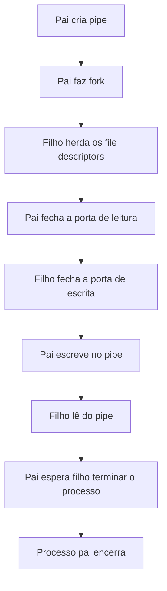

# Pipes

Um **pipe** é um canal de comunicação que o kernel usa para transportar bytes entre processos.

> Aqui entra um termo novo: IPC (*Inter-Process Communication*), ou seja, comunicação entre processos. O pipe é um tipo de IPC.

Um pipe é utilizado para enviar dados entre processos. No shell é muito simples ver isso:

```bash
ls | grep *.c
```

Esse `|` é um pipe. O `ls` escreve no pipe e o `grep` lê do pipe.

## Pipe Anônimo

O pipe mais básico é o **anonymous pipe**. Ele não tem nome no sistema de arquivos e normalmente é usado entre processos relacionados, principalmente entre pai e filho após um `fork()`.

```c
int fd[2];
pipe(fd);
```

Depois disso, temos que:

```text
fd[0] -> serve para realizar leitura
fd[1] -> serve para realizar escrita
```

Um detalhe importante é que o **pipe é unidirecional**, se quisermos comunicação nos dois sentidos, usamos dois pipes.

## Exemplo 01: Mesmo processo escrevendo e lendo

```c
#include <stdio.h>
#include <unistd.h>
#include <string.h>

int main() {
    int fd[2];

    if (pipe(fd) == -1) {
        perror("pipe");
        return 1;
    }

    const char *msg = "Olá pelo pipe\n";

    write(fd[1], msg, strlen(msg));

    char buffer[100];

    ssize_t n = read(fd[0], buffer, sizeof(buffer) - 1);

    if (n == -1) {
        perror("read");
        return 1;
    }
    
    buffer[n] = '\0';
    printf("Recebido: %s\n", buffer);

    close(fd[0]);
    close(fd[1]);
    
    return 0;
}
```

## Exemplo 02: Pai envia mensagem para o filho

```c
#include <stdio.h>
#include <unistd.h>
#include <string.h>
#include <sys/wait.h>

int main() {
    int fd[2];

    if (pipe(fd) == -1) {
        perror("pipe");
        return 1;
    }

    pid_t pid = fork();

    if (pid == -1) {
        perror("fork");
        return 1;
    }

    if (pid == 0) {
        // filho
        close(fd[1]);

        char buffer[100];
        
        ssize_t n = read(fd[0], buffer, sizeof(buffer) - 1);
        
        if (n == -1) {
            perror("read");
            close(fd[0]);
            return 1;
        }
        
        buffer[n] = '\0';
        
        printf("Filho recebeu: %s\n", buffer);
        
        close(fd[0]);
        
        return 0;
    } else {
        // pai só escreve
        close(fd[0]);

        const char *msg = "Mensagem enviada pelo pai";
        
        write(fd[1], msg, strlen(msg));
        
        close(fd[1]);
        
        wait(NULL);
    }
    return 0;
}
```

O fluxo é o seguinte:



## Exemplo 03: Ler até o EOF

Esse é um exemplo mais realista: o pai escreve várias mensagens e fecha o pipe. O filho lê até acabar.

```c
#include <stdio.h>
#include <unistd.h>
#include <string.h>
#include <sys/wait.h>

int main() {
    int fd[2];

    if (pipe(fd) == -1) {
        perror("pipe");
        return 1;
    }

    pid_t pid = fork();
    
    if (pid == -1) {
        perror("fork");
        return 1;
    }

    if (pid == 0) {
        close(fd[1]);

        char buffer[64];
        ssize_t n;

        while ((n = read(fd[0], buffer, sizeof(buffer))) > 0) {
            write(1, buffer, n);
        }

        if (n == -1) {
            perror("read");
            close(fd[0]);
            return 1;
        }

        close(fd[0]);
        return 0;
    } else {
        close(fd[0]);

        write(fd[1], "Linha 1\n", 8);
        write(fd[1], "Linha 2\n", 8);
        write(fd[1], "Linha 3\n", 8);
        
        close(fd[1]);
        wait(NULL);
    }
    return 0;
}
```

Aqui, o `close(fd[1])` no pai é fundamental, sem ele, o filho poderia ficar travado no `read()` esperando mais dados.

## Comportamento do pipe

- Se o pipe está vazio, mas ainda existe algum descritor aberto: **`read()` bloqueia**.
- Se o pipe está vazio e ninguém mais pode escrever: **`read()` retorna 0** (isso significa EOF).
- Se escrevemos em um pipe sem leitores (`fd[0]` fechado): **processo recebe `SIGPIPE`** e por padrão isso encerra o processo.

Exemplo:

- `yes` escreve infinatamente y no terminal.
- `head` mostra as 10 primeiras linhas apenas.

```bash
yes | head
```

Depois que o `head` lê as 10 primeiras linha, ele fecha o pipe e o `yes` recebe o `SIGPIPE`, pois continua tentando escrever, mas não há mais leitor no `pipe` e por isso o processo termina.

## Pipe como fluxo de bytes

O pipe não preserva "mensagens" do jeito que queremos. Para isso, precisamos criar protocolos, por exemplo:

- Cada mensagem terminar com `\n`
- Primeiros 4 bytes no envio indicam o tamanho da mensagem
- Entre outros
