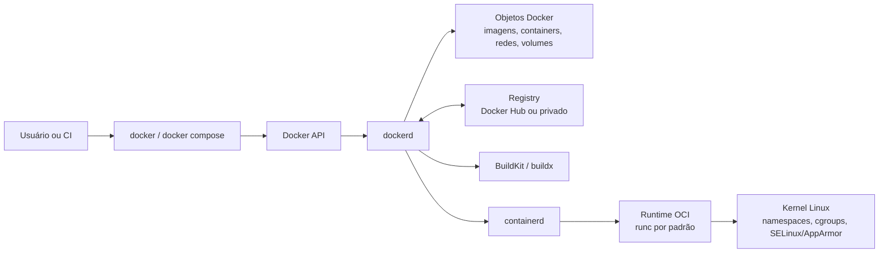
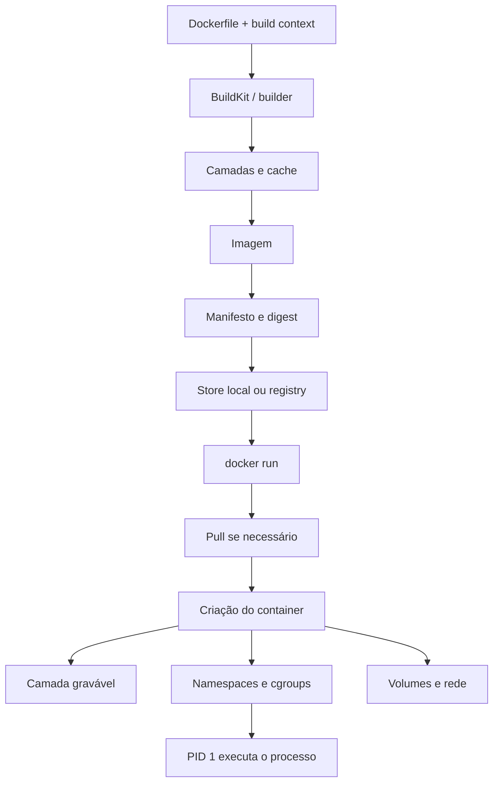

# Docker

## Resumo

Docker é uma plataforma para **desenvolver, distribuir e executar aplicações** usando containers. Na prática, ele empacota uma aplicação e suas dependências em uma unidade padronizada, executável em um ambiente "fracamente isolado" chamado `container`, com uma arquitetura cliente-servidor em que a **CLI** conversa com o **daemon** `dockerd` por uma API REST sobre um socket Unix ou uma rede.

O container **NÃO** é uma VM. Containers isolam **processos** no mesmo kernel do host. Já as VMs virtualizam uma máquina inteira, com **hipervisor** e **sistema operacional guest**. Por isso, containers tendem a ser menores, mais rápidos de iniciar e mais densos. Em contrapartida, seu isolamento depende das primitivas do kernel Linux, principalmente **namespaces, cgroups, capabilities, seccomp** e mecanismos de filesystem como **chroot/pivot_root**.

Na arquitetura do Docker, o `daemon` gerencia **imagens, containers, redes e volumes**; os `registries` armazenam imagens; as imagens são compostas por camadas e metadados; e a execução real do container passa pelo **containerd** e por um runtime OCI, cujo padrão é o `runc`, para então configurar namespaces, cgroups e outros controles no kernel.

## Primitivas do Kernel

|  Primitiva | O que faz | Relação com o Docker |
| :--- | :---: | ---: |
| Namespaces | Encapsulam recursos globais do sistema para que processos vejam instâncias isoladas desses recursos | São a base do isolamento de processos, mounts, rede, hostnames e afins |
| PID namespaces | Isolam os espaços de IDs de processo | Permitem que um processo seja PID 1 dentro do container e tenha árvore de processos própria |
| Mount namespaces | Isolam a lista de mounts visível para um processo | Permitem construir uma hierarquia de filesystem própria para o container |
| Network namespaces | Isolam interfaces, pilhas IPv4/IPv6, rotas, firewall e portas | Fazem cada container ter sua própria pilha de rede |
| Cgroups | Organizam processos em grupos hierárquicos e limitam/monitoram recursos | São a base de limites de CPU, memória e I/O e da observabilidade de consumo |

O `chroot()` apenas troca o diretório-raiz aparente do processo, **mount namespaces** definem a árvore de mounts que aquele processo vê e **cgroups** não isolam dados nem processos, mas controlam e medem recursos. O runtime monta o root filesystem, faz o processo entrar em novos namespaces e o coloca nos cgroups apropriados.

## Arquitetura do Docker

A arquitetura do Docker é **cliente-servidor**. O cliente `docker` envia comandos ao **daemon** `dockerd`, que faz o trabalho pesado de construir imagens, iniciar containers, gerenciar volumes e redes e interagir com os registries. O cliente e o daemon podem rodar no mesmo host ou em hosts separados e conversam pela **Docker API** por meio de um socket Unix ou de uma interface de rede.



## Imagens, Dockerfile e processo de build

Uma **imagem** é um template somente leitura (`readonly`) para criar containers. Um **container** é a instância executável dessa imagem. Para montar uma imagem, escrevemos um **Dockerfile**, que é um documento com instruções como `FROM`, `WORKDIR`, `COPY`, `RUN` e `CMD`.

As imagens são compostas por **camadas**. Cada instrução relevante do Dockerfile gera uma camada, e o cache de build reaproveita resultados anteriores quando a instrução e seus insumos continuam equivalentes. O comportamento mais importante é: **se uma camada muda, as camadas posteriores tendem a ser invalidadas também**. Por isso, a ordem do Dockerfile influencia diretamente a velocidade do build incremental.

A documentação do Docker recomenda ordenar as camadas para colocar os passos caros e estáveis primeiro, reduzir o contexto com o `.dockerignore` e usar **cache mounts** para gerenciadores de pacotes. Em alguns cenários, recomenda também usar **bind mounts durante o build** para não poluir o cache com artefatos que não precisam entrar na imagem final. A recomendação estrutural é usar **multi-stage builds**, que separam o ambiente de build do ambiente final de runtime, reduzindo o tamanho da imagem.



O builder processa o Dockerfile e o contexto, gera camadas reutilizáveis por cache e produz uma imagem identificável por tag e digest. No `docker run`, o Engine cria o container, aloca uma camada gravável final e configura namespaces, cgroups, rede e mounts antes de iniciar o processo principal.

Exemplo de um Dockerfile simples:

```Dockerfile
FROM python:3.12-slim

WORKDIR /app

COPY requirements.txt .

RUN pip install  --no-cache-dir -r requirements.txt

COPY . .

EXPOSE 8000

CMD ["python", "app.py"]
```

A opção `--no-cache-dir` desativa o uso do cache local ao instalar pacotes Python, forçando o download de arquivos diretamente do PyPI. Ela é fundamental para manter as imagens Docker leves, pois evita salvar arquivos de cache desnecessários.

Exemplo de build e inspeção:

```bash
docker build -t my-api:1.0 . # Este ponto se refere ao Dockerfile
docker image inspect my-api:1.0
docker history my-api:1.0
```

`docker build` recebe um contexto (`.`, neste caso, referindo-se ao diretório que contém o `Dockerfile`) e `docker inspect` retorna metadados em JSON sobre a imagem ou o container.

Geralmente, os comandos relacionados a imagens no Docker são executados com `docker image COMMAND`. Por meio da CLI, podemos digitar `docker image --help` para acessar o guia de ajuda.

## Execução de containers

Quando fazemos `docker run`, ele baixa a imagem se ela ainda não existe localmente, cria o container, aloca a camada gravável final, configura a rede e então inicia o processo principal.

```bash
docker run --name web -d -p 8080:80 nginx:alpine
docker exec -it web sh
docker stop web
docker rm web
```

Esses comandos cobrem o ciclo mais comum:

- Criar e iniciar (`run`)
- Entrar no container (`exec`)
- Parar o container (`stop`)
- Remover o container (`rm`)

A publicação de portas é feita com `-p`.

Persistência em Docker não deve ficar na camada gravável do container quando o dado precisa sobreviver à vida do processo. Para isso, o Engine oferece **volumes, bind mounts e tmpfs mounts**:

| Tipo | Persiste após parar/remover container? | Onde vive | Melhor uso | Observações |
| :--- | :------------------------------------: | :-------: | :--------: | ----------: |
| Named volume | Sim | Área gerenciada pelo Docker no host | Dados duráveis de aplicações, bancos e compartilhamentos entre containers | É o mecanismo preferido para persistência; o acesso direto ao diretório no host é desencorajado |
| Bind mount | Sim, porque aponta para um caminho do host | Caminho escolhido no host | Código-fonte, configurações, artefatos e integração entre o ambiente de desenvolvimento e o host | Por padrão, é gravável e acopla o container à estrutura do host; pode ocultar conteúdo preexistente no destino |
| tmpfs | Não | Memória do host | Dados temporários, sensíveis ou que não precisam persistir | É exclusivo do Linux no Docker Engine; pode ir para a área de swap e desaparece ao parar o container |
