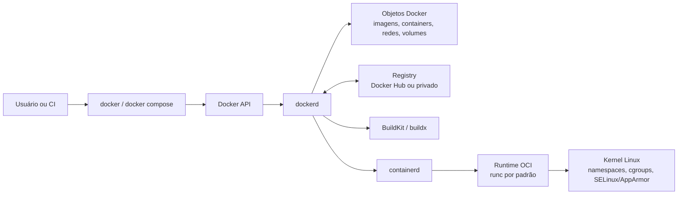
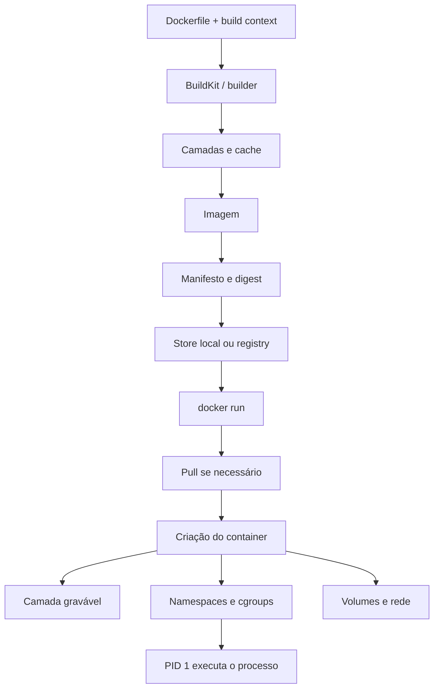

# Docker

## Resumo

Docker é uma plataforma para **desenvolver, distribuir e executar aplicações** usando contêineres. Na prática, ele empacota uma aplicação e suas dependências em uma unidade padronizada, executável em um ambiente isolado chamado **contêiner**. Sua arquitetura é cliente-servidor: a CLI conversa com o *daemon* `dockerd` pela API do Docker, normalmente por um *socket* Unix ou por uma interface de rede.

Um contêiner **não é uma máquina virtual**. Contêineres Linux isolam processos que compartilham o kernel do sistema Linux em que são executados, inclusive quando esse sistema está dentro de uma VM, como pode ocorrer no Docker Desktop. Já as VMs virtualizam uma máquina, com **hipervisor** e **sistema operacional convidado**. Por isso, contêineres tendem a ser menores e mais rápidos de iniciar. Em contrapartida, seu isolamento depende de recursos do kernel, principalmente ***namespaces*, *cgroups*, *capabilities* e *seccomp***, além de mecanismos como `chroot()` e `pivot_root()`.

Na arquitetura do Docker, o *daemon* gerencia **imagens, contêineres, redes e volumes**; os *registries* armazenam imagens; e as imagens são compostas por camadas e metadados. A execução de um contêiner passa pelo **containerd** e por um *runtime* OCI, normalmente o `runc`, que participa da configuração de *namespaces*, *cgroups* e outros controles do kernel.

## Recursos do kernel

|  Primitiva | O que faz | Relação com o Docker |
| :--- | :---: | ---: |
| *Namespaces* | Encapsulam recursos globais para que os processos vejam instâncias isoladas | São a base do isolamento de processos, pontos de montagem, rede, nomes de host e outros recursos |
| *PID namespaces* | Isolam os espaços de identificadores de processos | Permitem que um processo tenha PID 1 dentro do contêiner e veja uma árvore de processos própria |
| *Mount namespaces* | Isolam a lista de pontos de montagem visível para um processo | Permitem construir uma hierarquia de sistema de arquivos própria para o contêiner |
| *Network namespaces* | Isolam interfaces, pilhas IPv4 e IPv6, rotas, regras de *firewall* e portas | Permitem que cada contêiner tenha sua própria pilha de rede |
| *Cgroups* | Organizam processos em grupos hierárquicos e controlam recursos | Permitem contabilizar e limitar recursos como CPU, memória e I/O |

`chroot()` apenas troca o diretório-raiz aparente do processo. Os ***mount namespaces*** definem a árvore de pontos de montagem visível, enquanto os ***cgroups*** contabilizam e controlam recursos, mas não isolam os dados ou os identificadores dos processos. O *runtime* monta o sistema de arquivos raiz, associa o processo aos *namespaces* e o coloca nos *cgroups* apropriados.

## Arquitetura do Docker

A arquitetura do Docker é **cliente-servidor**. O cliente `docker` envia comandos ao *daemon* `dockerd`, que coordena a construção de imagens, inicia contêineres, gerencia volumes e redes e interage com os *registries*. O cliente e o *daemon* podem executar no mesmo *host* ou em *hosts* separados e se comunicam pela API do Docker.



## Imagens, Dockerfile e processo de construção

Uma **imagem** é um modelo imutável usado para criar contêineres. Um **contêiner** é uma instância executável dessa imagem. Para construir uma imagem, escrevemos um **Dockerfile** com instruções como `FROM`, `WORKDIR`, `COPY`, `RUN` e `CMD`.

As imagens são compostas por **camadas**. Cada instrução relevante do Dockerfile gera uma camada, e o cache de build reaproveita resultados anteriores quando a instrução e seus insumos continuam equivalentes. O comportamento mais importante é: **se uma camada muda, as camadas posteriores tendem a ser invalidadas também**. Por isso, a ordem do Dockerfile influencia diretamente a velocidade do build incremental.

Para aproveitar o *cache*, colocamos etapas caras e estáveis antes das que mudam com frequência. Também podemos reduzir o contexto com `.dockerignore`, usar ***cache mounts*** para gerenciadores de pacotes e adotar **construções em múltiplos estágios** (*multi-stage builds*), que separam o ambiente de construção da imagem final.



O builder processa o Dockerfile e o contexto, gera camadas reutilizáveis por cache e produz uma imagem identificável por tag e digest. No `docker run`, o Engine cria o container, aloca uma camada gravável final e configura namespaces, cgroups, rede e mounts antes de iniciar o processo principal.

Exemplo de um Dockerfile simples:

```Dockerfile
FROM python:3.12-slim

WORKDIR /app

COPY requirements.txt .

RUN pip install --no-cache-dir -r requirements.txt

COPY . .

EXPOSE 8000

CMD ["python", "app.py"]
```

A opção `--no-cache-dir` impede que o `pip` mantenha seu cache de downloads na camada da imagem. Ela não desativa o *cache* de camadas do Docker nem determina qual índice será usado. Com BuildKit, um *cache mount* pode preservar o cache entre construções sem copiá-lo para a imagem final.

Exemplo de build e inspeção:

```bash
docker build -t my-api:1.0 .
docker image inspect my-api:1.0
docker history my-api:1.0
```

`docker build` recebe um contexto de construção; nesse exemplo, `.` indica o diretório atual. Por padrão, o comando procura um arquivo chamado `Dockerfile` nesse contexto. `docker image inspect` retorna metadados JSON sobre a imagem.

Geralmente, os comandos relacionados a imagens no Docker são executados com `docker image COMMAND`. Por meio da CLI, podemos digitar `docker image --help` para acessar o guia de ajuda.

## Execução de contêineres

Quando fazemos `docker run`, ele baixa a imagem se ela ainda não existe localmente, cria o container, aloca a camada gravável final, configura a rede e então inicia o processo principal.

```bash
docker run --name web -d -p 8080:80 nginx:alpine
docker exec -it web sh
docker stop web
docker rm web
```

Esses comandos cobrem o ciclo mais comum:

- Criar e iniciar (`run`).
- Executar um comando no contêiner (`exec`).
- Parar o contêiner (`stop`).
- Remover o contêiner (`rm`).

A publicação de portas é feita com `-p`.

Dados que precisam sobreviver à remoção do contêiner não devem depender de sua camada gravável. Para esses casos, o Docker Engine oferece **volumes, *bind mounts* e *tmpfs mounts***:

| Tipo | Persiste após parar ou remover o contêiner? | Onde vive | Melhor uso | Observações |
| :--- | :------------------------------------: | :-------: | :--------: | ----------: |
| Named volume | Sim | Área gerenciada pelo Docker no host | Dados duráveis de aplicações, bancos e compartilhamentos entre containers | É o mecanismo preferido para persistência; o acesso direto ao diretório no host é desencorajado |
| Bind mount | Sim, porque aponta para um caminho do host | Caminho escolhido no host | Código-fonte, configurações, artefatos e integração entre o ambiente de desenvolvimento e o host | Por padrão, é gravável e acopla o container à estrutura do host; pode ocultar conteúdo preexistente no destino |
| tmpfs | Não | Memória do host | Dados temporários, sensíveis ou que não precisam persistir | É exclusivo do Linux no Docker Engine; pode ir para a área de swap e desaparece ao parar o container |
