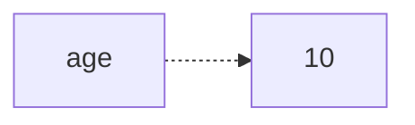

# Memória RAM

## Stack

A **stack** é uma área de memória usada para armazenar informações temporárias durante a execução de funções.

Ela normalmente contém:

- Variáveis locais simples
- Parâmetros de funções
- Endereço de retorno da função
- Informação da chamada (call stack)

Exemplo em C:

```c
void example() {
    int age = 10;
}
```

A variável `age` geralmente é armazenada na **stack**.

### Características

- Muito rápida
- Tamanho limitado (geralmente alguns MB)
- Gerenciada automaticamente
- Os dados desaparecem quando a função termina

## Heap

A **heap** é uma área de memória usada para armazenar dados que precisam viver por mais tempo ou cujo tamanho é conhecido apenas em tempo de execução.

Exemplo:

```c
int *age = malloc(sizeof(int));
*age = 10;
```

No exemplo acima, o ponteiro `age` fica na stack. O valor **10** fica na heap.



### Características

- Maior que a stack
- Alocação mais lenta
- Permite tamanhos dinâmicos
- Precisa ser liberada manualmente em algumas linguagens (como C)

```c
free(age);
```

Em linguagens como Java, Go e C#, a liberação normalmente é feita pelo **garbage collector**.

## Ponteiros

Um ponteiro é uma variável que guarda o endereço de memória de outra variável.

```c
int age = 10;
int *p = &age;
```

Temos que:

```text
age = 10

p = endereço de age
```

Visualmente:

```text
0x1000 -> age = 10

p = 0x1000
```

O operador `&` significa: "Qual é o endereço de memória de `age`?"

O operador `*` significa: "Acesse o valor armazenado naquele endereço".

Exemplo:

```c
printf("%d", *p);

// Saída: 10
```

## Relação entre Ponteiros, Stack e Heap

Um caso clássico:

```c
int *p = malloc(sizeof(int));
*p = 50;
```

O que acontece:

1. A variável `p` é criada na stack.
2. `malloc` reserva na heap um espaço com o tamanho de um `int`.
3. O endereço desse espaço é armazenado em `p`.
4. `*p = 50` grava o valor 50 naquele endereço.

## Resumo Prático

- **Pergunta**: O dado existe apenas durante a execução da função?

Provavelmente está na **stack**.

- **Pergunta**: O dado precisa sobreviver ao término da função ou tem tamanho dinâmico?

Provavelmente está na **heap**.

- **Pergunta**: Como encontrar esse dado na memória?

Por meio de um **ponteiro** (ou referência, em linguagens de mais alto nível).

- Resumo: **a _stack_ guarda variáveis locais e o contexto da execução; a _heap_ guarda objetos e dados alocados dinamicamente; ponteiros são endereços que permitem acessar esses dados na memória.**
