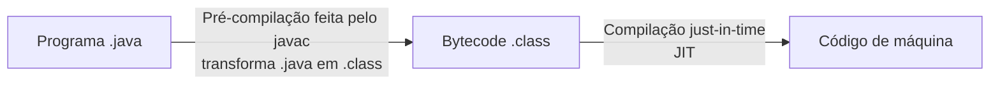

# Java

## Introdução

Java é uma linguagem orientada a objetos, sendo uma linguagem de pré-compilação + máquina virtual

- Código compilado para bytecode e executado em uma máquina virtual (JVM)
- Portável, segura e robusta
- Roda em vários tipos de dispositivos

- **Java ME**: Java Micro Edition - dispositivos embarcados e móveis (IOT)
- **Java SE**: Java Standard Edition - core (desktops e servidores)
- **Java EE**: Java Enterprise Edition - aplicações corporativas
- **JavaFX**: Plataforma de software multimídia

### Java SE



Java possui um conceito WORA (write once run anywhere).

- Uma **aplicação** Java é composta por **classes**
- Um **pacote** é um conjunto de classes relacionadas (`package`), exemplo: Entities, Services, Repositories
- Um **módulo** é um agrupamento lógico de pacotes relacionados, exemplo: Módulo Financial (dentro dele temos as Entities, Services e Repositories)
- **Aplicação** é um agrupamento de módulos relacionados, exemplo: Sistema de comércio eletrônico

Instalação JDK:

> Linux: sudo apt install openjdk-25-jdk

### Orientação a Objetos

Java é uma linguagem de programação orientada a objetos. Isso significa que em Java tudo é escrito em termos de classes e objetos. Os pilares da programação orientada a objetos (POO) são:

1. Classe e objeto;
2. Encapsulamento;
3. Abstração
4. Herança
5. Polimorfismo

### JVM (Java Virtual Machine)

É um programa que carrega e executa os aplicativos Java, convertendo os Bytecodes em código executável de máquina. A JVM é responsável pelo gerenciamento dos aplicativos, à medida que são executados. Graças a JVM, os programas escritos em Java podem funcionar em qualquer plataforma, de hardware e software que possua uma versão da JVM, tornando assim essas aplicações independentes de plataforma onde funcionam.

### Componentes

O Java se subdivide em componentes de desenvolvimento (JDK) e de execução (JRE), isso quer dizer que, se pretende desenvolver aplicações, é necessário ter instalado o JDK, mas para disponibilizar o executável (.jar), basta ter a instalação do JRE.

#### JDK

- Composto pelo compilador (javac + JVM)
- Visualizador de applets, bibliotecas de desenvolvimento
- Programa para composição de documentação (javadoc)
- Depurador básico de programas e versão da JRE

#### JRE

- É composta de uma JVM e por um conjunto de bibliotecas que permite a execução de softwares em Java
- Apenas permite a execução de programas, ou seja, é necessário o programa Java compilado pela JDK gerando os arquivos `.class`

---

## Hello World em Java

```java
public class Main {
    public static void main(String[] args) {
        System.out.println("Hello World!");
    }
}
```

> O `static` em Java é diferente do `static` em C. Em java significa que a classe pode usar esse atributo/método sem instanciar de fato a classe, já em C, serve para usar o valor da variável atual caso já tenha sido inicializada em outro momento no código.

---

## Tipos primitivos em Java

Os tipos primitivos em Java são:

| Tipo | Tamanho | Valor Padrão |
| :--: | :-----: | :----------: |
| byte | 1 byte | 0 |
| short | 2 bytes | 0 |
| int | 4 bytes | 0 |
| long | 8 bytes | 0L |
| float | 4 bytes | 0.0f |
| double | 8 bytes | 0.0 |
| char | 1 byte | '\u0000' |
| bool | 1 bit | false |

Temos ainda outros tipos, como `String` que nesse caso é uma classe, mas podemos ter `String nome = "Lucas";`

O padrão de variáveis em Java é o camelCase (ex: `myFirstVar`) e para classes usamos o padrão PascalCase (ex: `MyFirstClass`)

---

## Separador de Decimais

Em Java, o separador de decimais é o padrão da linguagem da máquina, para setarmos um valor em específico, podemos usar o `Locale`:

```java
import java.util.Locale

public class Main {
    public static void main(String[] args) {
        Locale.setDefault(Locale.US); 
        // Nesse caso, vai usar o separador padrão dos US (".")
    }
}
```

---

## Entrada de dados em Java

Utilizamos o `Scanner` para ler algo do teclado e os métodos `nextInt`, `nextLine()`, e outros mais

```java
import java.util.Scanner

public class Main {
    public static void main(String[] args) {
        Scanner sc = new Scanner(System.in);
        int num = sc.nextInt();
        System.out.println("Número: " + num);
        // Exemplo de concatenação em java (se usar o printf é igual em C)
        sc.close();
    }
}

```

---

## Casting de variáveis

Podemos fazer o casting de variáveis em Java, imagina que recebemos um double, mas queremos transformar esse valor em int:

```java
double a = 10.0;
int b = (int) a;
```
