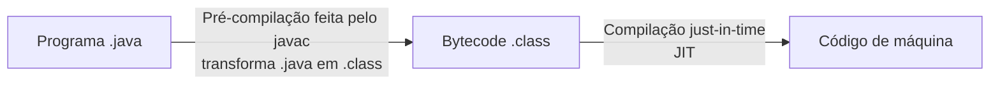

# Java - Primeiros Passos

## Introdução

Java é uma linguagem orientada a objetos. Seu código-fonte é compilado para bytecode, que é executado pela máquina virtual Java.

- Código compilado para bytecode e executado em uma máquina virtual (JVM)
- Portável, segura e robusta
- Pode ser executada em vários tipos de dispositivos

- **Java ME**: Java Micro Edition - dispositivos embarcados e móveis (IoT)
- **Java SE**: Java Standard Edition - core (desktops e servidores)
- **Java EE**: Java Enterprise Edition - aplicações corporativas
- **JavaFX**: plataforma de software multimídia

### Java SE



Java adota o conceito WORA (_write once, run anywhere_).

- Uma **aplicação** Java é composta por **classes**
- Um **pacote** é um conjunto de classes relacionadas (`package`). Exemplo: `entities`, `services` e `repositories`
- Um **módulo** é um agrupamento lógico de pacotes relacionados. Exemplo: módulo financeiro, contendo `entities`, `services` e `repositories`
- Uma **aplicação** é um agrupamento de módulos relacionados. Exemplo: sistema de comércio eletrônico

Instalação do JDK:

> Linux: sudo apt install openjdk-25-jdk

### Orientação a Objetos

Java é uma linguagem de programação orientada a objetos. Isso significa que em Java tudo é escrito em termos de classes e objetos. Os pilares da programação orientada a objetos (POO) são:

1. Classe e objeto
2. Encapsulamento
3. Abstração
4. Herança
5. Polimorfismo

### JVM (Java Virtual Machine)

É um programa que carrega e executa aplicações Java, convertendo o bytecode em código de máquina durante a execução. A JVM também gerencia recursos enquanto as aplicações são executadas. Graças à JVM, os programas escritos em Java podem funcionar em qualquer plataforma de hardware e software que possua uma implementação compatível, tornando-se independentes da plataforma em que são executados.

### Componentes

O ecossistema Java inclui componentes de desenvolvimento (JDK) e de execução (JRE). Para desenvolver aplicações, é necessário ter o JDK instalado. Para executar uma aplicação, é necessário um ambiente de execução Java compatível.

#### JDK

- Composto pelo compilador `javac`, pela JVM e por outras ferramentas de desenvolvimento
- Visualizador de applets, bibliotecas de desenvolvimento
- Programa para composição de documentação (javadoc)
- Depurador básico de programas e uma implementação da JRE

#### JRE

- É composta por uma JVM e por um conjunto de bibliotecas que permitem a execução de software em Java
- Permite a execução de programas; portanto, o código Java precisa ter sido compilado pelo JDK para gerar os arquivos `.class`

---

## Hello World em Java

```java
public class Main {
    public static void main(String[] args) {
        System.out.println("Hello World!");
    }
}
```

> O `static` em Java é diferente do `static` em C. Em Java, um membro estático pertence à classe e pode ser acessado sem criar uma instância. Em C, o efeito depende do contexto: uma variável local estática preserva seu valor entre chamadas, enquanto uma declaração estática no escopo do arquivo tem ligação interna.

---

## Tipos primitivos em Java

Os tipos primitivos em Java são:

| Tipo | Tamanho | Valor padrão dos campos |
| :--: | :-----: | :----------: |
| byte | 1 byte | 0 |
| short | 2 bytes | 0 |
| int | 4 bytes | 0 |
| long | 8 bytes | 0L |
| float | 4 bytes | 0.0f |
| double | 8 bytes | 0.0 |
| char | 2 bytes | '\u0000' |
| boolean | Não especificado | false |

Temos ainda outros tipos, como `String`, que é uma classe. Por exemplo: `String nome = "Lucas";`.

O padrão de nomenclatura para variáveis em Java é o camelCase (por exemplo, `myFirstVar`), enquanto para classes usamos PascalCase (por exemplo, `MyFirstClass`).

---

## Separador de decimais

Em Java, a formatação de números pode seguir a configuração regional padrão do ambiente. Para definir uma configuração específica, podemos usar `Locale`:

```java
import java.util.Locale;

public class Main {
    public static void main(String[] args) {
        Locale.setDefault(Locale.US);
        // Nesse caso, usará o separador decimal dos EUA (".")
    }
}
```

---

## Entrada de dados em Java

Utilizamos o `Scanner` e métodos como `nextInt()` e `nextLine()` para ler dados do teclado.

```java
import java.util.Scanner;

public class Main {
    public static void main(String[] args) {
        Scanner sc = new Scanner(System.in);
        int num = sc.nextInt();
        System.out.println("Número: " + num);
        // Exemplo de concatenação em Java (printf tem sintaxe semelhante à de C)
        sc.close();
    }
}

```

---

## Conversão de variáveis

Podemos fazer a conversão explícita (_casting_) de variáveis em Java. Imaginemos que recebemos um `double`, mas queremos transformar esse valor em `int`:

```java
double a = 10.0;
int b = (int) a;
```

## Estrutura condicional

Em Java, temos o padrão `if`, `else if` e `else`, muito parecido com C:

```java
if (idade < 18) {
    System.out.println("Menor de idade");
} else if (idade >= 18 && idade < 60) {
    System.out.println("Maior de idade (adulto)");
} else {
    System.out.println("Maior de idade (idoso)");
}
```

Além disso, temos o `switch-case`, muito parecido com C também:

```java
switch (valor) {
    case 1:
        System.out.println("Valor 1");
        break;
    case 2:
        System.out.println("Valor 2");
        break;
    case 3:
        System.out.println("Valor 3");
        break;
    default:
        System.out.println("Inválido");
        break;
}
```

Temos também o operador ternário:

```java
boolean maiorIdade = (idade >= 18) ? true : false;
```

## Estruturas repetitivas

Em Java, temos as estruturas repetitivas `for`, `while` e `do-while`:

Exemplo de for:

```java
for (int i = 0; i < 10; i++) {
    System.out.println(i);
}
```

Exemplo de while:

```java
int i = 0;

while (true) {
    if (i == 100) {
        System.out.println("Fim do while");
        break;
    }
    i++;
}
```

Exemplo de do-while:

```java
int x = 10;

do {
    System.out.println("VALOR DE X = " + x);
    x++;
} while(x < 20);
```

## Funções

Em Java, as funções declaradas dentro de classes são chamadas de métodos. Eles geralmente são usados da seguinte maneira: `Math.sqrt()`. Nesse caso, `sqrt()` é um método estático da classe `Math`.

As strings em Java têm alguns métodos interessantes, por exemplo:

- `.toLowerCase()`: transforma a string em minúscula
- `.toUpperCase()`: transforma a string em maiúscula
- `.replace(char1 | string1, char2 | string2)`: troca as ocorrências de `char1` ou `string1` por `char2` ou `string2`
- `.length()`: retorna o tamanho da string
- `.trim()`: remove espaços em branco do início e do fim da string
- `.substring(inicio, fim)`: obtém uma parte da string original no intervalo `[inicio, fim)`
- `.indexOf(string)`: obtém o índice da primeira ocorrência da substring ou `-1` se ela não existir
- `.split(regex)`: divide a string usando a expressão regular informada e retorna um array

Além desses métodos, há outros que podem ser consultados na documentação.

Para criar um método, precisamos seguir o seguinte formato:

```text
[modificador de acesso] [tipo de retorno] [nome do método]() {}
```

Por exemplo:

```java
public double soma(double x, double y) {
    return x + y;
}
```

_Observação_: podemos usar `static` quando o método pertencer à classe e não exigir a criação de um objeto.
