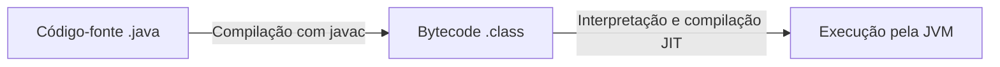

# Java — primeiros passos

## Introdução

Java é uma linguagem orientada a objetos. Seu código-fonte é compilado para bytecode, que é executado pela máquina virtual Java.

- O código é compilado para *bytecode* e executado por uma máquina virtual Java (JVM).
- A plataforma oferece portabilidade, gerenciamento automático de memória e verificações em tempo de execução.
- Implementações compatíveis estão disponíveis para diferentes sistemas e dispositivos.

- **Java ME**: Java Platform, Micro Edition, voltada a dispositivos embarcados.
- **Java SE**: Java Platform, Standard Edition, base da plataforma para aplicações de propósito geral.
- **Jakarta EE**: sucessora do Java EE para aplicações corporativas e serviços web.
- **JavaFX**: conjunto de APIs para interfaces gráficas.

### Java SE



Java adota o conceito WORA (_write once, run anywhere_).

- Uma **aplicação** Java é formada por classes, interfaces e outros tipos.
- Um **pacote** cria um espaço de nomes e agrupa tipos relacionados. Exemplos: `com.example.entities` e `com.example.services`.
- Um **módulo** do Java Platform Module System agrupa pacotes, declara dependências e controla quais pacotes são exportados por meio de `module-info.java`.
- Uma aplicação pode usar um ou mais módulos, mas a modularização explícita não é obrigatória.

Instalação do JDK:

> Em distribuições baseadas em Debian, `sudo apt install default-jdk` instala o JDK padrão disponibilizado pelos repositórios configurados.

### Orientação a objetos

Java organiza grande parte do código em classes e objetos, embora também possua tipos primitivos. Conceitos importantes da programação orientada a objetos incluem:

1. Classes e objetos.
2. Encapsulamento.
3. Abstração.
4. Herança.
5. Polimorfismo.

### JVM (Java Virtual Machine)

A JVM carrega, verifica e executa *bytecode*, usando interpretação e, conforme a implementação, compilação *just-in-time*. Ela também gerencia recursos como memória e coleta de lixo. Um arquivo `.class` pode ser executado em plataformas que possuam uma JVM compatível com os recursos utilizados.

### Componentes

O ecossistema Java inclui ferramentas de desenvolvimento e componentes de execução. Para desenvolver aplicações, instalamos um JDK. Para executá-las, precisamos de um ambiente compatível, que pode ser fornecido pelo próprio JDK ou por uma imagem de *runtime* criada para a aplicação.

#### JDK

- Inclui o compilador `javac`, ferramentas de empacotamento e uma implementação da JVM.
- Fornece bibliotecas e ferramentas de desenvolvimento.
- Inclui `javadoc` para gerar documentação e `jdb` para depuração.

#### JRE

- Um ambiente de execução inclui uma JVM e as bibliotecas necessárias para executar a aplicação.
- O código-fonte normalmente é compilado para arquivos `.class` antes da execução.

---

## “Olá, mundo!” em Java

```java
public class Main {
    public static void main(String[] args) {
        System.out.println("Olá, mundo!");
    }
}
```

> O `static` em Java é diferente do `static` em C. Em Java, um membro estático pertence à classe e pode ser acessado sem criar uma instância. Em C, o efeito depende do contexto: uma variável local estática preserva seu valor entre chamadas, enquanto uma declaração estática no escopo do arquivo tem ligação interna.

---

## Tipos primitivos em Java

Os tipos primitivos em Java são:

| Tipo | Tamanho | Valor padrão dos campos |
| :--: | :-----: | :----------: |
| `byte` | 1 byte | `0` |
| `short` | 2 bytes | `0` |
| `int` | 4 bytes | `0` |
| `long` | 8 bytes | `0L` |
| `float` | 4 bytes | `0.0f` |
| `double` | 8 bytes | `0.0` |
| `char` | 2 bytes | `'\u0000'` |
| `boolean` | Não especificado | `false` |

Temos ainda outros tipos, como `String`, que é uma classe. Por exemplo: `String nome = "Lucas";`.

A convenção de nomenclatura para variáveis em Java é *lower camel case*, como `myFirstVar`, enquanto classes normalmente usam *upper camel case*, como `MyFirstClass`.

---

## Separador de decimais

Em Java, a formatação de números pode seguir a configuração regional padrão do ambiente. Para definir uma configuração específica, podemos usar `Locale`:

```java
import java.util.Locale;

public class Main {
    public static void main(String[] args) {
        Locale.setDefault(Locale.US);
        // Usa o ponto como separador decimal na formatação regional.
    }
}
```

---

## Entrada de dados em Java

Utilizamos o `Scanner` e métodos como `nextInt()` e `nextLine()` para ler dados do teclado.

```java
import java.util.Scanner;

public class Main {
    public static void main(String[] args) {
        Scanner sc = new Scanner(System.in);
        int num = sc.nextInt();
        System.out.println("Número: " + num);
        // Exemplo de concatenação em Java.
        sc.close();
    }
}

```

---

## Conversão de variáveis

Podemos fazer a conversão explícita (_casting_) de variáveis em Java. Imaginemos que recebemos um `double`, mas queremos transformar esse valor em `int`:

```java
double a = 10.0;
int b = (int) a;
```

## Estrutura condicional

Em Java, temos o padrão `if`, `else if` e `else`, muito parecido com C:

```java
if (idade < 18) {
    System.out.println("Menor de idade");
} else if (idade >= 18 && idade < 60) {
    System.out.println("Maior de idade (adulto)");
} else {
    System.out.println("Maior de idade (idoso)");
}
```

Além disso, temos a instrução `switch`, semelhante à de C:

```java
switch (valor) {
    case 1:
        System.out.println("Valor 1");
        break;
    case 2:
        System.out.println("Valor 2");
        break;
    case 3:
        System.out.println("Valor 3");
        break;
    default:
        System.out.println("Inválido");
        break;
}
```

Temos também o operador ternário:

```java
String categoria = idade >= 18 ? "adulto" : "menor de idade";
```

## Estruturas repetitivas

Em Java, temos as estruturas repetitivas `for`, `while` e `do-while`:

Exemplo de `for`:

```java
for (int i = 0; i < 10; i++) {
    System.out.println(i);
}
```

Exemplo de `while`:

```java
int i = 0;

while (true) {
    if (i == 100) {
        System.out.println("Fim do while");
        break;
    }
    i++;
}
```

Exemplo de `do-while`:

```java
int x = 10;

do {
    System.out.println("VALOR DE X = " + x);
    x++;
} while (x < 20);
```

## Funções

Em Java, as funções declaradas dentro de classes são chamadas de métodos. Eles geralmente são usados da seguinte maneira: `Math.sqrt()`. Nesse caso, `sqrt()` é um método estático da classe `Math`.

As strings em Java têm alguns métodos interessantes, por exemplo:

- `.toLowerCase()`: converte a *string* para minúsculas conforme as regras aplicáveis.
- `.toUpperCase()`: converte a *string* para maiúsculas conforme as regras aplicáveis.
- `.replace(alvo, substituto)`: troca as ocorrências do alvo pelo valor substituto.
- `.length()`: retorna a quantidade de unidades de código UTF-16, que pode ser diferente da quantidade de caracteres Unicode percebidos pelo usuário.
- `.trim()`: remove caracteres com valor menor ou igual a `U+0020` das extremidades; `strip()` considera espaços em branco Unicode.
- `.substring(inicio, fim)`: obtém uma parte da *string* no intervalo `[inicio, fim)`.
- `.indexOf(string)`: obtém o índice da primeira ocorrência ou `-1` se ela não existir.
- `.split(regex)`: divide a *string* usando a expressão regular informada e retorna um *array*.

Além desses métodos, há outros que podem ser consultados na documentação.

Para criar um método, precisamos seguir o seguinte formato:

```text
[modificadores] [tipo de retorno] [nome do método]([parâmetros]) { ... }
```

Por exemplo:

```java
public double somar(double x, double y) {
    return x + y;
}
```

_Observação_: podemos usar `static` quando o método pertencer à classe e não exigir a criação de um objeto.
