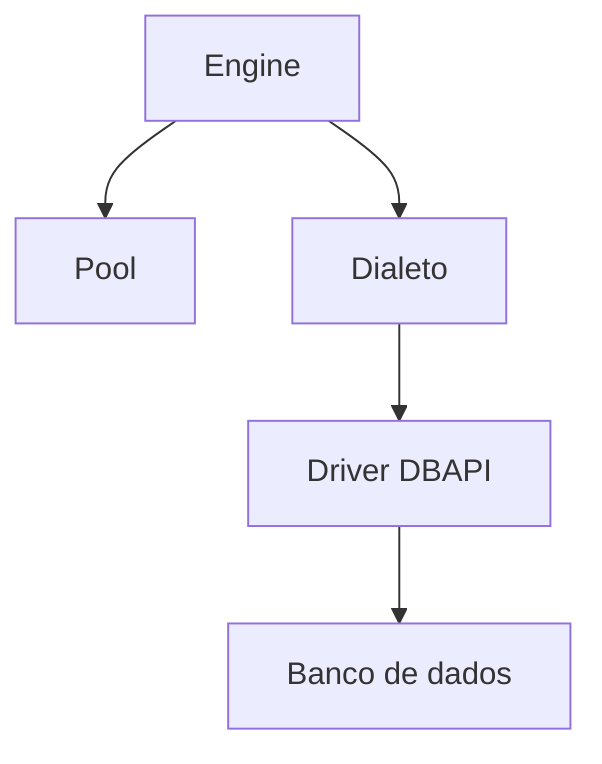
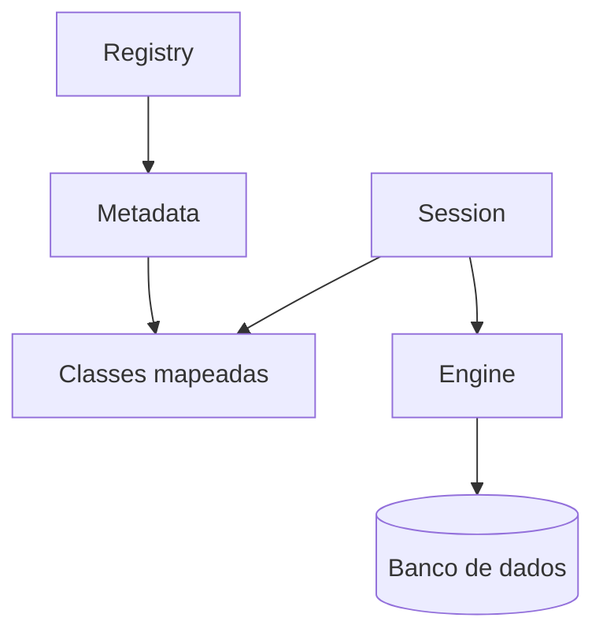

# SQLAlchemy

## Core

O Core fornece integração com bancos de dados, gerenciamento de conexões, transações, tipos e uma linguagem de expressões SQL.

1. `Engine`.

- **`Connection`**: interface para executar instruções em uma conexão com o banco.
- **Dialeto**: adapta o SQLAlchemy ao banco e ao *driver* DBAPI selecionados.
- **Pool**: administra conexões DBAPI para reutilização.

2. SQL Expression Language.

Construções em Python para representar SQL.

3. Esquemas e tipos.

Construções em Python que representam tabelas, colunas e tipos de dados.

### Engine

O `Engine` combina um *pool* de conexões com um dialeto. Ele é a fonte usada para obter objetos `Connection`, mas normalmente só abre a primeira conexão DBAPI quando ela é necessária.



Exemplo 1:

```python
from sqlalchemy import create_engine

# Banco SQLite em memória.
engine = create_engine("sqlite+pysqlite:///:memory:")
```

Para usar um arquivo, podemos informar `sqlite+pysqlite:///database.db`.

### Dialetos

O `Engine` cria conexões usando o dialeto correspondente. Os dialetos adaptam as operações do SQLAlchemy aos *drivers* específicos de cada banco.

Por exemplo, o SQLAlchemy suporta nativamente:

- SQLite.
- PostgreSQL.
- MySQL e MariaDB.
- Oracle.
- Microsoft SQL Server.

Também há diversas implementações por meio de _plugins_, como CockroachDB, Firebird e Amazon Redshift.

### Conexão

Quando o `Engine` conhece o dialeto e o *driver* especificados na URL, ele pode obter uma conexão e iniciar a comunicação com o banco:

Exemplo 2:

```python
from sqlalchemy import create_engine, text

engine = create_engine("sqlite+pysqlite:///database.db", echo=True)

with engine.connect() as connection:
    result = connection.execute(text("SELECT 1"))
    print(result.scalar_one())
```

A opção `echo=True` envia ao *log* as instruções executadas pelo `Engine`.

### Pool

Abrir uma conexão com o banco pode ser uma operação relativamente cara. Por isso, o SQLAlchemy normalmente usa um `Pool` para reutilizar conexões DBAPI. Fechar uma `Connection` do SQLAlchemy em geral devolve a conexão DBAPI ao *pool*.

### Transação

Uma transação em um banco de dados é uma operação tratada como uma unidade de trabalho indivisível. **ACID** é uma sigla para as quatro principais características que definem uma transação:

- **Atomicidade**: as alterações de uma transação são confirmadas como uma unidade ou revertidas.
- **Consistência**: uma transação correta preserva as restrições e invariantes definidas no banco e na aplicação.
- **Isolamento**: o banco controla como os efeitos de transações concorrentes se tornam visíveis; as garantias exatas dependem do nível de isolamento.
- **Durabilidade**: depois da confirmação, as alterações devem sobreviver às falhas cobertas pelas garantias do sistema de armazenamento.

Exemplo 3, com uma consulta:

```python
from sqlalchemy import create_engine, text

engine = create_engine("sqlite+pysqlite:///database.db", echo=True)

with engine.connect() as connection:
    statement = text("SELECT id, name, comment FROM comments")
    result = connection.execute(statement)

    for row in result:
        print(row)
```

Exemplo 4, com uma transação gerenciada pelo contexto:

```python
from sqlalchemy import create_engine, text

engine = create_engine("sqlite+pysqlite:///database.db", echo=True)

with engine.begin() as connection:
    statement = text(
        "INSERT INTO comments (name, comment) "
        "VALUES (:name, :comment)"
    )
    connection.execute(
        statement,
        {"name": "Lucas", "comment": "Exemplo"},
    )
```

`engine.begin()` confirma a transação ao sair normalmente do bloco e a reverte se uma exceção escapar. Com `engine.connect()`, a primeira execução inicia uma transação automaticamente, que deve ser confirmada ou revertida quando houver alterações.

Exemplo 5, com uma conexão assíncrona:

```python
import asyncio

from sqlalchemy import text
from sqlalchemy.ext.asyncio import create_async_engine

async def main() -> None:
    engine = create_async_engine(
        "sqlite+aiosqlite:///database.db",
        echo=True,
    )

    async with engine.connect() as connection:
        statement = text("SELECT id, name, comment FROM comments")
        result = await connection.execute(statement)
        print(result.all())

    await engine.dispose()


asyncio.run(main())
```

Esse exemplo exige o *driver* `aiosqlite`.

### Result

O resultado obtido com `execute()` é um objeto `Result`. Ele é iterável e oferece métodos como:

- `.fetchone()`: obtém a próxima linha ou `None`.
- `.fetchmany(3)`: obtém até três linhas.
- `.partitions(3)`: itera sobre grupos de até três linhas.
- `.fetchall()` ou `.all()`: obtém todas as linhas restantes.
- `.first()`: obtém a primeira linha ou `None` e fecha o conjunto de resultados.

Exemplo 6:

```python
from sqlalchemy import create_engine, text

engine = create_engine("sqlite+pysqlite:///database.db", echo=True)

with engine.connect() as conn:
    statement = text("SELECT id, name, comment FROM comments")
    result = conn.execute(statement)
    print(result.first())
```

### Esquemas e tipos

Os metadados das tabelas podem ser descritos por schemas, como os nomes das colunas e seus respectivos tipos.

Exemplo 7:

```python
import sqlalchemy as sa

metadata = sa.MetaData()

comments = sa.Table(
    "comments",
    metadata,
    sa.Column("id", sa.Integer(), nullable=False),
    sa.Column("name", sa.String(), nullable=False),
    sa.Column("comment", sa.String(), nullable=False),
    sa.Column("live", sa.String(), nullable=False),
    sa.Column("created_at", sa.DateTime(), nullable=False),
    sa.PrimaryKeyConstraint("id"),
)

engine = sa.create_engine("sqlite+pysqlite:///database.db")
metadata.create_all(engine)
```

### Reflexão

As funções de inspeção podem ser usadas na construção de schemas para carregar os metadados de um banco que já existe:

Exemplo 8:

```python
from sqlalchemy import create_engine, Table, MetaData

engine = create_engine("sqlite+pysqlite:///database.db")
metadata = MetaData()

comments = Table("comments", metadata, autoload_with=engine)

print(comments.columns)
```

### SQL Expression Language

Até o momento, todas as operações foram feitas com `text()` e SQL bruto. O **Core** tem um grupo de funções e objetos que ajudam a montar instruções SQL:

- **DQL** (*Data Query Language*): consultas.
- **DML** (*Data Manipulation Language*): inserções, atualizações e exclusões.

Esses recursos são usados em conjunto com os schemas.

#### DQL

Uma das operações mais importantes em bancos de dados é a consulta aos dados (_query_). O SQLAlchemy tem um sistema completo para criar consultas. Começando pelo básico, temos `select()`:

```python
stmt = select(comments)
print(stmt)
# SELECT comments.id, comments.name, comments.comment, comments.live,
# comments.created_at FROM comments
```

##### CompoundSelect

O resultado de `select()` é um construtor de instruções (_builder_). Com ele, podemos encadear métodos e criar uma consulta mais complexa:

```python
stmt = (
    select(comments.c.name, comments.c.comment)
    .where(comments.c.name == "Lucas Borges")
    .limit(3)
    .offset(0)
    .order_by(comments.c.id)
)
```

#### DML

Quando precisamos manipular dados no SQL, usamos algumas das seguintes instruções:

- **`delete()`**: remove registros.
- **`insert()`**: insere registros.
- **`update()`**: atualiza registros.

##### Inserção

```python
stmt = insert(comments).values(
    name="lucas",
    comment="teste",
    live="youtube",
    created_at=datetime.now(),
)
```

##### Atualização

```python
stmt = (
    update(comments)
    .where(
        comments.c.name == "lucas",
        comments.c.comment == "teste",
        comments.c.live == "youtube",
    )
    .values(comment="teste 2")
)
```

##### Exclusão

```python
stmt = delete(comments).where(
    comments.c.name == "lucas",
    comments.c.live == "youtube",
)
```

## ORM (Object-Relational Mapper)

- **Objeto**: uma instância de uma classe Python.
- **Relacional**: as tabelas, colunas, chaves e relações de um banco relacional.
- **Mapeamento**: a associação entre classes e tabelas, na qual instâncias representam linhas.

Exemplo 9, usando a forma declarativa tradicional:

```python
from sqlalchemy import Column, DateTime, Integer, String, func
from sqlalchemy.orm import DeclarativeBase

class Base(DeclarativeBase):
    pass


class Comment(Base):
    __tablename__ = "comments"

    id = Column(Integer, primary_key=True)
    name = Column(String, nullable=False)
    comment = Column(String, nullable=False)
    live = Column(String, nullable=False)
    created_at = Column(DateTime, server_default=func.now())
```

Exemplo 10, usando mapeamento anotado:

```python
from datetime import datetime
from sqlalchemy import func
from sqlalchemy.orm import DeclarativeBase, Mapped, mapped_column

class Base(DeclarativeBase):
    pass


class Comment(Base):
    __tablename__ = "comments"

    id: Mapped[int] = mapped_column(primary_key=True)
    name: Mapped[str]
    comment: Mapped[str]
    live: Mapped[str]
    created_at: Mapped[datetime] = mapped_column(server_default=func.now())
```

Exemplo 11, com *dataclass*:

```python
from datetime import datetime
from sqlalchemy import func
from sqlalchemy.orm import Mapped, mapped_column, registry

reg = registry()

@reg.mapped_as_dataclass
class Comment:
    __tablename__ = "comments"

    id: Mapped[int] = mapped_column(init=False, primary_key=True)
    name: Mapped[str]
    comment: Mapped[str]
    live: Mapped[str]
    created_at: Mapped[datetime] = mapped_column(
        init=False, server_default=func.now()
    )
```

### `Session`

A `Session` gerencia uma transação e uma unidade de trabalho com objetos mapeados. Ela mantém um mapa de identidade, acompanha alterações e obtém conexões do `Engine` conforme necessário. Uma `Session` não deve ser compartilhada simultaneamente entre *threads* ou tarefas assíncronas.



Exemplo 12:

```python
from sqlalchemy.orm import Session

with Session(engine) as s:
    comment = s.get(Comment, 1)

    if comment is not None:
        s.delete(comment)
        s.commit()
```

> Use `scalar()` quando a instrução deve produzir um único valor e `scalars()` para iterar sobre a primeira coluna de cada linha, como em uma seleção de entidades. Para resultados com várias colunas, trabalhe com as linhas retornadas por `execute()`.
